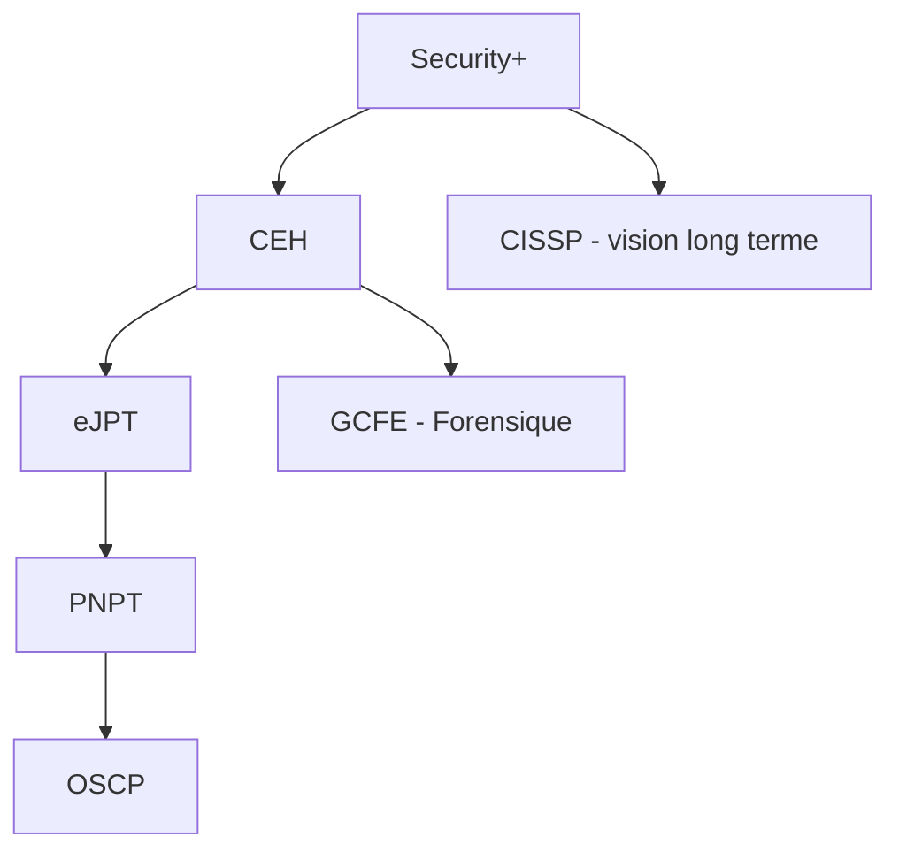

## Introduction

Ce dernier chapitre du cours d'introduction referme la boucle conceptuelle avant de plonger dans les cours techniques. Il répond à une question simple mais souvent négligée : dans quel ordre progresser, et pourquoi ces certifications précisément ? Comprendre la logique du parcours rend chaque cours suivant plus motivant, parce que tu sais exactement où il te mène.

## Les grandes familles de métiers

<CompareTable
  titleA="Famille"
  titleB="Exemples de métiers"
  rows={[
    { a: "Offensif (Red Team)", b: "Pentester, Red Teamer, chercheur de vulnérabilités" },
    { a: "Défensif (Blue Team)", b: "Analyste SOC, Threat Hunter, ingénieur détection" },
    { a: "Réponse à incident / Forensique", b: "Analyste DFIR, investigateur numérique" },
    { a: "Gouvernance, Risque, Conformité (GRC)", b: "RSSI, auditeur ISO 27001, DPO" },
    { a: "Sécurité applicative", b: "AppSec engineer, développeur sécurisé, DevSecOps" },
  ]}
/>

<TipCallout>
Ces familles ne sont pas étanches : un bon pentester comprend la défense, et un bon analyste SOC doit penser comme un attaquant. Nyx couvre volontairement l'offensif ET le défensif pour cette raison.
</TipCallout>

## La logique du parcours de certifications Nyx

<CompareTable
  titleA="Certification"
  titleB="Positionnement"
  rows={[
    { a: "CompTIA Security+", b: "Base généraliste, prérequis conceptuel avant toute spécialisation" },
    { a: "CEH v13", b: "Panorama large des techniques offensives, très orienté théorie et vocabulaire" },
    { a: "eJPT", b: "Première certification 100% pratique, accessible en sortie de CEH" },
    { a: "PNPT", b: "Pentest complet de bout en bout avec rapport professionnel à produire" },
    { a: "OSCP", b: "Référence historique de l'exigence pratique en pentest" },
    { a: "GCFE", b: "Spécialisation forensique numérique (branche DFIR)" },
    { a: "CISSP", b: "Vision managériale et transversale, pertinente après plusieurs années d'expérience" },
  ]}
/>

<CehCallout>
Ce n'est pas un hasard si Nyx structure ses cours (Linux, Réseaux, Web Security, Active Directory, DFIR, Cryptographie) autour des prérequis directs du CEH — chaque cours technique correspond à un ou plusieurs modules officiels du référentiel.
</CehCallout>

## Construire un plan de progression réaliste

<Steps steps={[
  { title: "Consolider les fondamentaux", description: "Termine Linux, Réseaux et ce cours d'introduction avant toute certification — ce sont les prérequis silencieux de tout le reste." },
  { title: "Viser une première certification généraliste", description: "Security+ ou directement CEH selon ton niveau de départ, pour valider un socle théorique large." },
  { title: "Basculer vers la pratique", description: "eJPT puis PNPT pour développer une véritable méthodologie de test d'intrusion de bout en bout." },
  { title: "Se spécialiser", description: "OSCP pour l'offensif pur, GCFE pour la forensique, ou CISSP pour une trajectoire managériale à plus long terme." },
]} />

<WarningCallout>
Une erreur fréquente est de viser l'OSCP trop tôt, sans bases réseau ni Linux solides. La difficulté ressentie n'est alors pas celle du pentest, mais celle des fondamentaux qui auraient dû être acquis avant — ce qui démotive inutilement.
</WarningCallout>

## Suivre sa progression sur Nyx

La page **Certifications** de la plateforme calcule automatiquement ton taux de préparation pour chaque certification, en fonction des cours liés que tu as complétés. C'est un indicateur pour prioriser, pas un objectif en soi — la vraie compétence se construit dans les chapitres et les labs, pas dans le pourcentage affiché.

## Lab — Mise en Pratique

**Environnement** : Réflexion guidée (pas de terminal requis pour ce chapitre)

<Steps steps={[
  { title: "Auto-évaluation", description: "Note honnêtement ton niveau actuel (débutant / intermédiaire / confirmé) sur Linux et sur les réseaux — ce sont les deux prérequis silencieux les plus fréquemment sous-estimés." },
  { title: "Choisir sa première cible", description: "En fonction de ton objectif de carrière (offensif, défensif, GRC, forensique), identifie quelle certification de la liste devrait être ta priorité à 12 mois." },
]} />

## Pour aller plus loin

### Construire un portfolio, pas juste des diplômes

Les certifications valident un socle de connaissances, mais un recruteur en cybersécurité — particulièrement côté offensif — accorde souvent autant d'importance à un **portfolio concret** :

- **Write-ups de CTF** : documenter sur un blog ou GitHub la résolution de machines TryHackMe/HackTheBox, en expliquant la méthodologie suivie
- **Contributions open source** : un outil, un script, ou une correction proposée à un projet de sécurité existant
- **Profil bug bounty** : un historique de rapports acceptés sur HackerOne ou Bugcrowd, même modestes au départ
- **Certifications pratiques (OSCP, eJPT, PNPT)** : leur valeur perçue vient justement du rapport ou de l'examen pratique produit, pas seulement du badge

<TipCallout>
Les labs Nyx que tu complètes, une fois documentés (scénario, méthodologie, captures d'écran), constituent déjà une première brique de portfolio réutilisable pour candidater ou répondre à un programme de bug bounty.
</TipCallout>

### Rester à jour : une discipline, pas une option

La cybersécurité évolue vite — une certification obtenue aujourd'hui couvre un paysage de menaces qui aura changé dans deux ans. Quelques habitudes structurent une veille efficace sans y consacrer un temps déraisonnable :

<CompareTable
  titleA="Type de source"
  titleB="Exemple concret"
  rows={[
    { a: "Bulletins de vulnérabilités", b: "CVE/NVD, avis CERT-FR pour le contexte francophone" },
    { a: "Communautés techniques", b: "Comptes de chercheurs en sécurité, conférences (DEF CON, Black Hat, les talks sont publiés gratuitement)" },
    { a: "Rapports annuels sectoriels", b: "Verizon DBIR, rapport de menaces de l'ANSSI, rapports d'éditeurs EDR/SIEM" },
]}
/>

<CehCallout>
Le maintien des certifications professionnelles (CISSP, CEH) exige d'ailleurs explicitement des crédits de formation continue (CPE/ECE) — la veille n'est pas qu'une bonne pratique informelle, c'est une condition contractuelle de renouvellement.
</CehCallout>

### Et après la première certification ? Les parcours de spécialisation

Une fois les fondamentaux et une première certification pratique acquis, les trajectoires se diversifient fortement selon l'appétence :

- **Red Team avancée** : OSCE³, CRTO, spécialisation Active Directory offensive
- **Cloud Security** : certifications spécifiques AWS/Azure/GCP orientées sécurité, de plus en plus demandées à mesure que les infrastructures migrent vers le cloud
- **Threat Intelligence** : GCTI, analyse de groupes APT, corrélation de campagnes
- **Reverse engineering / Malware Analysis** : GREM, analyse statique et dynamique de binaires malveillants

Aucune de ces spécialisations n'a de sens sans les fondamentaux couverts par ce cours d'introduction et les cours Linux/Réseaux — elles en sont le prolongement naturel, pas un raccourci possible.

## En résumé

- Les métiers de cybersécurité se répartissent en grandes familles : offensif, défensif, DFIR, GRC, AppSec.
- Le parcours Nyx suit une logique de progression : Security+/CEH → eJPT → PNPT → OSCP, avec des branches spécialisées (GCFE, CISSP).
- Les cours techniques de Nyx sont directement alignés sur les prérequis du CEH.
- Viser une certification avancée sans bases solides (Linux, réseaux) est l'erreur de parcours la plus fréquente.

## Questions de Révision

1. Cite les cinq grandes familles de métiers en cybersécurité.
2. Pourquoi le CEH est-il positionné avant l'eJPT dans le parcours Nyx ?
3. Quelle est l'erreur de progression la plus fréquente que ce chapitre met en garde ?

Tu viens de terminer le cours **Introduction à la Cybersécurité** — direction **Linux** et **Réseaux Informatiques** pour construire les bases techniques de ton parcours.
