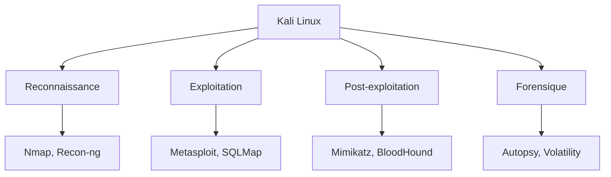

## Introduction

Linux est le système d'exploitation de référence en cybersécurité offensive et défensive. La quasi-totalité des outils de pentest, des serveurs exposés sur Internet et des systèmes d'analyse forensique tournent sous Linux. Maîtriser ce système n'est donc pas optionnel : c'est le socle sur lequel repose tout le reste de ta progression vers le CEH, l'eJPT ou l'OSCP.

Dans ce chapitre, tu vas découvrir Kali Linux, la distribution de référence pour les tests d'intrusion, comprendre comment le système de fichiers est organisé, et te familiariser avec le terminal — ton outil de travail principal pour les prochains mois.

## Pourquoi Kali Linux ?

Kali Linux est une distribution basée sur Debian, maintenue par Offensive Security, qui embarque plus de 600 outils dédiés au pentest, à l'audit et à la forensique. Elle n'est pas destinée à un usage quotidien classique : c'est un établi d'artisan, pas un système grand public.



## Le système de fichiers Linux

Contrairement à Windows, Linux n'a pas de lettres de lecteur : tout part d'une racine unique, `/`. Voici les répertoires que tu croiseras le plus souvent :

- `/etc` — fichiers de configuration système
- `/var/log` — journaux système, précieux en investigation
- `/home` — répertoires personnels des utilisateurs
- `/usr/share/wordlists` — dictionnaires utilisés pour le bruteforce
- `/root` — répertoire personnel de l'administrateur (root)

```bash
# Explorer l'arborescence depuis la racine
ls -la /
tree -L 2 /usr/share
```

<TipCallout>
Le raccourci `cd -` te ramène instantanément au répertoire précédent. Très utile quand tu navigues entre plusieurs dossiers de travail pendant un audit.
</TipCallout>

## Permissions et propriétaires

Chaque fichier Linux possède un propriétaire, un groupe, et des permissions de lecture (r), écriture (w) et exécution (x) pour trois catégories : le propriétaire, le groupe, et les autres.

<CompareTable
  titleA="Notation symbolique"
  titleB="Notation octale"
  rows={[
    { a: "rwxr-xr-x", b: "755" },
    { a: "rw-r--r--", b: "644" },
    { a: "rwx------", b: "700" },
  ]}
/>

```bash
# Modifier les permissions d'un script
chmod 755 script.sh

# Changer le propriétaire d'un fichier
chown user:group fichier.txt
```

<CehCallout>
Les binaires SUID (bit `s` sur le propriétaire) s'exécutent avec les droits de leur propriétaire, souvent root. C'est un vecteur classique d'élévation de privilèges en CTF comme en environnement réel — le CEH t'interrogera dessus.
</CehCallout>

## Lab — Mise en Pratique

**Environnement** : Kali Linux (terminal Nyx Shell)

<Steps steps={[
  { title: "Explorer le système", description: "Liste les répertoires principaux et identifie leur rôle.", code: "ls -la / && tree -L 2 /usr/share" },
  { title: "Vérifier la configuration réseau", description: "Affiche ton adresse IP et la table de routage.", code: "ip a && ip route" },
  { title: "Lister les outils de pentest", description: "Explore les catégories d'outils fournies par Kali.", code: "ls /usr/share/wordlists" },
]} />

<WarningCallout>
Ne lance jamais d'outils de scan ou d'exploitation contre une cible que tu n'es pas explicitement autorisé à tester. Toutes les commandes de ce cours doivent être exécutées uniquement dans les labs Nyx ou sur des machines t'appartenant.
</WarningCallout>

## Pour aller plus loin

### Personnaliser son environnement de travail

Un pentester passe des centaines d'heures dans un terminal — quelques réglages simples font gagner un temps considérable sur la durée :

```bash
# Créer un alias permanent (ajouté à ~/.bashrc)
echo "alias ll='ls -la'" >> ~/.bashrc
echo "alias ports='ss -tulpn'" >> ~/.bashrc
source ~/.bashrc

# Variables d'environnement utiles en session de pentest
export TARGET=10.10.0.10
nmap -sS $TARGET
```

<TipCallout>
Documenter tes alias et variables dans un fichier `~/.pentest_profile` versionné (Git privé) te permet de retrouver ton environnement de travail identique sur chaque nouvelle machine Kali.
</TipCallout>

### Gestion des paquets avec APT

Kali utilise le gestionnaire de paquets `apt`, hérité de Debian. Comprendre son fonctionnement est indispensable dès qu'un outil manque à l'appel.

```bash
# Mettre à jour la liste des paquets disponibles (à faire avant toute installation)
apt update

# Installer un nouvel outil
apt install -y seclists

# Rechercher un paquet par mot-clé
apt search wordlist

# Mettre à jour tous les paquets installés
apt upgrade -y
```

<WarningCallout>
Sans `apt update` préalable, `apt install` échoue souvent avec "Unable to locate package" — la liste locale des paquets disponibles n'a simplement pas encore été synchronisée avec les dépôts.
</WarningCallout>

### Les éditions de Kali Linux

Kali existe sous plusieurs formes selon le contexte d'usage : l'image ISO complète (installation classique), Kali Purple (orientée défense/SOC, avec des outils Blue Team en plus), Kali NetHunter (adaptation Android pour pentest mobile), et des images cloud (AWS, Azure) pour des campagnes de test à grande échelle. Le cœur d'outils reste le même — seul l'emballage change.

## En résumé

- Kali Linux est une distribution Debian orientée pentest, avec plus de 600 outils préinstallés.
- Le système de fichiers Linux part d'une racine unique `/` — pas de lettres de lecteur comme sous Windows.
- Les permissions (rwx) s'appliquent à trois catégories : propriétaire, groupe, autres.
- Les binaires SUID sont un vecteur d'élévation de privilèges à surveiller de près.

## Questions de Révision

1. Quelle commande permet de lister les fichiers cachés d'un répertoire ?
2. Quelle est la différence entre les permissions 755 et 644 ?
3. Pourquoi les binaires SUID sont-ils surveillés lors d'un audit de sécurité ?
