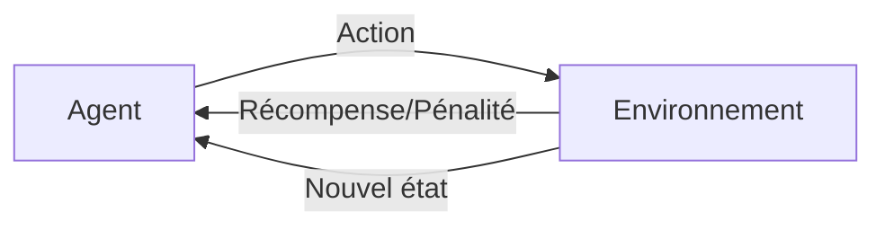

## Introduction

Ce cours approfondit les algorithmes de machine learning déjà rencontrés de façon appliquée au cours Data Science Complète — il ne s'agit plus seulement de savoir QUAND utiliser un algorithme, mais de comprendre PRÉCISÉMENT comment chacun fonctionne mathématiquement, en s'appuyant sur le socle du cours Algèbre Linéaire.

## Rappel et complément des paradigmes d'apprentissage

<CompareTable
  titleA="Paradigme"
  titleB="Principe (rappel et complément du cours Data Science Complète)"
  rows={[
    { a: "Supervisé (ch.5 Data Science Complète)", b: "Apprend à partir d'exemples déjà étiquetés" },
    { a: "Non supervisé (ch.6 Data Science Complète)", b: "Cherche des motifs sans étiquettes préalables" },
    { a: "Par renforcement (nouveau)", b: "Un agent apprend par essai-erreur, en recevant une récompense ou une pénalité selon ses actions" },
]}
/>

## L'apprentissage par renforcement

<CehCallout>
Rappel du cours IA & Agents en Cybersécurité (chapitre 4) : un agent qui apprend par renforcement explore un environnement, reçoit une récompense (positive ou négative) après chaque action, et ajuste progressivement sa stratégie pour maximiser la récompense cumulée sur le long terme — un paradigme totalement différent du supervisé, où aucune "bonne réponse" n'est fournie à l'avance.
</CehCallout>

<TipCallout>
L'apprentissage par renforcement est notamment utilisé pour entraîner des agents capables de jouer à des jeux complexes ou d'optimiser des décisions séquentielles — un principe qui rejoint conceptuellement le cycle observation-décision-action des agents IA déjà étudié, mais où l'apprentissage lui-même se fait par cette boucle de récompense.
</TipCallout>

## Pourquoi approfondir maintenant, après la data science appliquée

<CehCallout>
Rappel du cours Python pour la Data Science (chapitre 7) : scikit-learn permet d'entraîner un modèle en quelques lignes (`.fit()`, `.predict()`) sans connaître le détail mathématique sous-jacent — ce cours ouvre précisément cette "boîte noire" pratique, pour comprendre pourquoi et comment chaque algorithme fonctionne, une compétence qui permet d'ajuster finement un modèle plutôt que de simplement l'utiliser par défaut.
</CehCallout>

## Ce que ce cours réutilise du parcours Nyx

<Steps steps={[
  { title: "Algèbre Linéaire", description: "Vecteurs, matrices, produit scalaire — le langage mathématique de chaque algorithme détaillé dans ce cours." },
  { title: "Mathématiques Appliquées", description: "Probabilités et statistiques, nécessaires pour comprendre les fondements de nombreux algorithmes." },
  { title: "Data Science Complète", description: "Le cadre méthodologique général (cycle de vie, évaluation) dans lequel s'insère chaque algorithme approfondi ici." },
]} />

## Lab — Mise en Pratique

**Environnement** : Réflexion guidée (sans terminal)

<Steps steps={[
  { title: "Distinguer les trois paradigmes", description: "Pour chacun de ces cas, identifie le paradigme (supervisé, non supervisé, par renforcement) : classer des emails en phishing/légitime, regrouper des malwares similaires sans étiquette, entraîner un agent à optimiser une stratégie de défense réseau par essais successifs." },
  { title: "Expliquer l'intérêt d'approfondir", description: "Pourquoi comprendre le détail mathématique d'un algorithme (au-delà du simple `.fit()`/`.predict()` de scikit-learn) permet-il de mieux l'ajuster à un problème spécifique ?" },
]} />

## En résumé

- Ce cours approfondit mathématiquement les algorithmes de machine learning déjà rencontrés de façon appliquée au cours Data Science Complète.
- L'apprentissage par renforcement, un troisième paradigme, apprend par essai-erreur via une boucle de récompense, sans exemples étiquetés ni motifs à découvrir directement.
- Comprendre le détail mathématique d'un algorithme permet de l'ajuster finement, au-delà de son usage par défaut via une bibliothèque comme scikit-learn.

## Questions de Révision

1. Quelle est la différence fondamentale entre l'apprentissage par renforcement et l'apprentissage supervisé ?
2. Pourquoi ce cours choisit-il d'approfondir mathématiquement des algorithmes déjà utilisés de façon appliquée précédemment ?
3. Quels cours Nyx fournissent le socle mathématique mobilisé tout au long de ce cours ?
