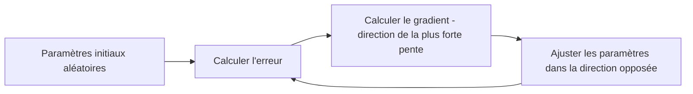

## Introduction

Ce chapitre détaille les deux algorithmes les plus fondamentaux du machine learning supervisé — la régression linéaire pour prédire une valeur continue, la régression logistique pour classer, un socle indispensable avant d'aborder des modèles plus complexes.

## La régression linéaire — prédire une valeur continue

<CehCallout>
La régression linéaire cherche la droite (ou l'hyperplan en plusieurs dimensions, rappel du cours Algèbre Linéaire) qui minimise l'écart entre les valeurs prédites et les valeurs réelles observées — une formalisation mathématique précise de "prédire une tendance" déjà pressentie intuitivement au cours Data Science Complète (chapitre 3, sur les nuages de points).
</CehCallout>

```text
Modèle de régression linéaire simple :
y = a*x + b

où a est la pente (l'influence de x sur y) et b l'ordonnée à l'origine.
Avec plusieurs variables (régression multiple) :
y = a1*x1 + a2*x2 + ... + an*xn + b
```

## La fonction de coût — mesurer l'erreur du modèle

<Steps steps={[
  { title: "Calculer l'erreur pour chaque exemple", description: "La différence entre la valeur prédite et la valeur réelle observée." },
  { title: "Élever au carré et moyenner", description: "Rappel du cours Mathématiques Appliquées (chapitre 6, écart-type) : élever au carré élimine les signes négatifs, la moyenne donne l'erreur quadratique moyenne (MSE)." },
  { title: "Chercher les paramètres qui minimisent cette erreur", description: "L'objectif de l'entraînement : trouver la droite (les valeurs de a et b) qui minimise l'erreur quadratique moyenne sur l'ensemble des exemples." },
]} />

## La descente de gradient — comment le modèle apprend

<CehCallout>
La descente de gradient est l'algorithme qui ajuste progressivement les paramètres du modèle pour minimiser la fonction de coût — à chaque étape, elle calcule dans quelle direction modifier chaque paramètre pour réduire l'erreur, un peu comme descendre une pente en suivant toujours la direction la plus raide vers le bas.
</CehCallout>



<TipCallout>
Le "taux d'apprentissage" (learning rate) contrôle la taille de chaque pas de la descente de gradient — trop grand, le modèle peut "sauter" au-delà du minimum sans jamais converger ; trop petit, l'entraînement devient extrêmement lent, un compromis similaire à d'autres paramètres de réglage déjà rencontrés dans le parcours.
</TipCallout>

## La régression logistique — de la valeur continue à la classification

<WarningCallout>
Malgré son nom, la régression logistique sert à la classification, pas à la régression au sens strict — elle applique une fonction sigmoïde au résultat d'une régression linéaire pour obtenir une probabilité entre 0 et 1 (par exemple, la probabilité qu'un email soit du phishing), puis classe selon un seuil (généralement 0,5).
</WarningCallout>

```text
Régression logistique :
probabilité = 1 / (1 + e^-(a*x + b))

Si probabilité > 0.5 → classe 1 (ex : phishing)
Sinon → classe 0 (ex : légitime)
```

## Lab — Mise en Pratique

**Environnement** : Python 3 (terminal Nyx Shell ou environnement local avec `scikit-learn`/`pandas`/`numpy` installés)

<Steps steps={[
  { title: "Préparer un petit jeu de données", description: "Construis un jeu de données jouet où x représente des heures d'étude et y le score obtenu à un examen.", code: "import numpy as np\nX = np.array([[1], [2], [3], [4], [5]])\ny = np.array([50, 55, 65, 70, 80])" },
  { title: "Entraîner une régression linéaire avec scikit-learn", description: "Rappel du cours Python pour la Data Science (chapitre 7) : entraîne un modèle LinearRegression et lis les paramètres a et b appris, au sens de y = a*x + b.", code: "from sklearn.linear_model import LinearRegression\nreg = LinearRegression().fit(X, y)\nprint('a (pente):', reg.coef_[0])\nprint('b (intercept):', reg.intercept_)" },
  { title: "Passer à la régression logistique", description: "Transforme le problème en classification binaire (score >= 65 -> réussite) et entraîne une LogisticRegression pour obtenir une probabilité de réussite, au sens de la fonction sigmoïde vue plus haut.", code: "from sklearn.linear_model import LogisticRegression\ny_classe = (y >= 65).astype(int)\nclf = LogisticRegression().fit(X, y_classe)\nproba = clf.predict_proba(X)\nprint('probabilites de reussite:', proba[:, 1])" },
  { title: "Observer l'effet du taux d'apprentissage", description: "Entraîne un SGDRegressor avec un taux d'apprentissage très petit puis très grand, et compare les coefficients obtenus pour constater qu'un taux trop élevé déstabilise la convergence.", code: "from sklearn.linear_model import SGDRegressor\nfor lr in [0.001, 1.0]:\n    sgd = SGDRegressor(eta0=lr, learning_rate='constant', max_iter=50).fit(X, y)\n    print('eta0=', lr, '-> coef:', sgd.coef_, 'intercept:', sgd.intercept_)" },
]} />

## En résumé

- La régression linéaire cherche les paramètres qui minimisent l'erreur quadratique moyenne entre valeurs prédites et réelles.
- La descente de gradient ajuste progressivement ces paramètres en suivant la direction qui réduit le plus l'erreur.
- La régression logistique applique une fonction sigmoïde pour transformer une régression linéaire en probabilité de classification.

## Questions de Révision

1. Que cherche à minimiser l'entraînement d'une régression linéaire ?
2. Comment la descente de gradient ajuste-t-elle les paramètres d'un modèle à chaque étape ?
3. Pourquoi la régression logistique, malgré son nom, sert-elle à la classification plutôt qu'à la régression au sens strict ?
