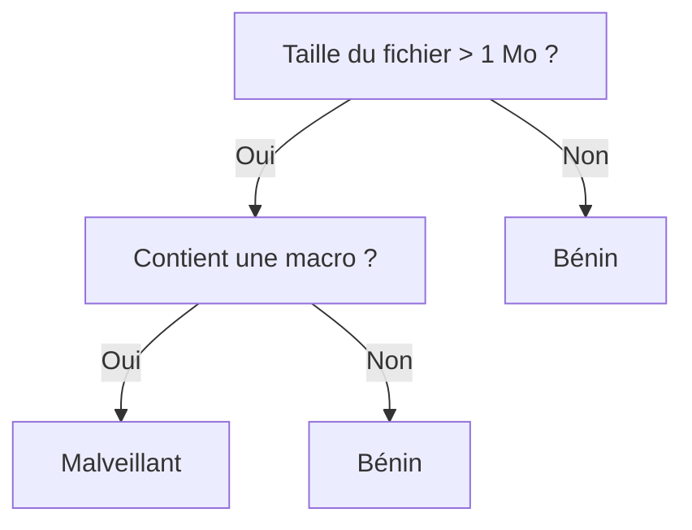

## Introduction

Ce chapitre détaille les arbres de décision et les méthodes d'ensemble qui les combinent — des algorithmes parmi les plus utilisés en pratique, y compris pour la détection d'anomalies en cybersécurité, déjà mentionnés sans détail au cours Data Science Complète (chapitre 5).

## Construire un arbre de décision

<CehCallout>
Un arbre de décision divise successivement les données selon des questions simples (par exemple "la taille du fichier dépasse-t-elle 1 Mo ?") choisies pour séparer au mieux les classes à chaque étape — un principe qui se rapproche d'un organigramme de décision, lisible et interprétable, contrairement à de nombreux autres modèles.
</CehCallout>

<TipCallout>
Le critère de séparation à chaque nœud est choisi pour maximiser la "pureté" des groupes résultants — rappel du concept d'entropie (cours Mathématiques Appliquées, chapitre 5) : un groupe parfaitement pur (une seule classe) a une entropie nulle, l'algorithme cherche donc la question qui réduit le plus l'entropie à chaque division.
</TipCallout>

## La faiblesse d'un arbre isolé — le surapprentissage

<WarningCallout>
Un arbre de décision poussé trop en profondeur mémorise les particularités du jeu d'entraînement plutôt que d'apprendre une règle générale — rappel direct du surapprentissage (overfitting) déjà rencontré au cours Data Science Complète (chapitre 6) : un arbre trop profond obtient un score parfait sur l'entraînement mais généralise mal à de nouvelles données.
</WarningCallout>

## Le bagging — Random Forest

<CehCallout>
Une forêt aléatoire (Random Forest) entraîne un grand nombre d'arbres de décision, chacun sur un sous-échantillon aléatoire des données et des variables, puis combine leurs prédictions (vote majoritaire en classification, moyenne en régression) — cette technique s'appelle le bagging (bootstrap aggregating).
</CehCallout>

<Steps steps={[
  { title: "Tirer des sous-échantillons aléatoires", description: "Chaque arbre de la forêt est entraîné sur un sous-ensemble différent des données, tiré avec remise (bootstrap)." },
  { title: "Limiter les variables considérées à chaque nœud", description: "Chaque arbre ne considère qu'un sous-ensemble aléatoire des variables disponibles à chaque division, augmentant la diversité entre arbres." },
  { title: "Combiner les prédictions", description: "La prédiction finale résulte du vote majoritaire (classification) ou de la moyenne (régression) de tous les arbres de la forêt." },
]} />

<TipCallout>
Cette diversité entre arbres est la clé du succès du bagging : des arbres individuellement faibles ou surajustés, une fois combinés, compensent mutuellement leurs erreurs respectives — un principe similaire à la sagesse des foules, où l'agrégation de nombreux avis indépendants surpasse souvent un avis unique, même expert.
</TipCallout>

## Le boosting — Gradient Boosting

<CehCallout>
Contrairement au bagging qui entraîne des arbres indépendamment puis les combine, le boosting (dont Gradient Boosting est l'exemple le plus connu) entraîne les arbres séquentiellement — chaque nouvel arbre est entraîné spécifiquement pour corriger les erreurs commises par les arbres précédents.
</CehCallout>

<CompareTable
  titleA="Bagging (Random Forest)"
  titleB="Boosting (Gradient Boosting)"
  rows={[
    { a: "Arbres entraînés indépendamment et en parallèle", b: "Arbres entraînés séquentiellement, chacun corrigeant le précédent" },
    { a: "Réduit principalement la variance (surapprentissage)", b: "Réduit principalement le biais (sous-apprentissage), au risque de surapprendre si mal réglé" },
    { a: "Plus simple à paralléliser, entraînement rapide", b: "Généralement plus performant mais plus sensible aux réglages" },
]}
/>

## Lab — Mise en Pratique

**Environnement** : Python 3 (terminal Nyx Shell ou environnement local avec `scikit-learn`/`pandas`/`numpy` installés)

<Steps steps={[
  { title: "Préparer un petit jeu de données", description: "Reconstruis en données le scénario du diagramme ci-dessus : taille de fichier (Mo) et présence d'une macro, pour prédire si le fichier est malveillant.", code: "import numpy as np\nX = np.array([[0.5, 0], [2, 1], [3, 1], [0.2, 0], [5, 1], [1, 0], [4, 0], [6, 1]])\ny = np.array([0, 1, 1, 0, 1, 0, 0, 1])  # 0=benin, 1=malveillant" },
  { title: "Construire un arbre de décision isolé", description: "Entraîne un DecisionTreeClassifier et affiche les questions qu'il pose à chaque nœud — comparable au diagramme de décision vu plus haut.", code: "from sklearn.tree import DecisionTreeClassifier, export_text\nclf = DecisionTreeClassifier(max_depth=2, random_state=0).fit(X, y)\nprint(export_text(clf, feature_names=['taille_mo', 'a_macro']))" },
  { title: "Entraîner une Random Forest (bagging)", description: "Entraîne une forêt aléatoire sur les mêmes données et inspecte l'importance de chaque variable dans la décision finale.", code: "from sklearn.ensemble import RandomForestClassifier\nrf = RandomForestClassifier(n_estimators=100, random_state=0).fit(X, y)\nprint('importance des variables:', rf.feature_importances_)" },
  { title: "Comparer avec le Gradient Boosting", description: "Entraîne un Gradient Boosting et compare ses scores en validation croisée à ceux de la forêt aléatoire, pour relier au tableau comparatif bagging vs boosting.", code: "from sklearn.ensemble import GradientBoostingClassifier\nfrom sklearn.model_selection import cross_val_score\ngb = GradientBoostingClassifier(random_state=0)\nprint('scores Gradient Boosting (cv=3):', cross_val_score(gb, X, y, cv=3))" },
]} />

## En résumé

- Un arbre de décision divise successivement les données selon des questions choisies pour maximiser la pureté des groupes résultants.
- Un arbre isolé, trop profond, surapprend facilement — les méthodes d'ensemble corrigent cette faiblesse en combinant plusieurs arbres.
- Le bagging (Random Forest) entraîne des arbres indépendamment en parallèle ; le boosting (Gradient Boosting) les entraîne séquentiellement, chacun corrigeant les erreurs du précédent.

## Questions de Révision

1. Comment un arbre de décision choisit-il la question à poser à chaque nœud ?
2. Pourquoi un arbre de décision isolé, trop profond, généralise-t-il souvent mal ?
3. Quelle est la différence fondamentale entre le bagging et le boosting ?
