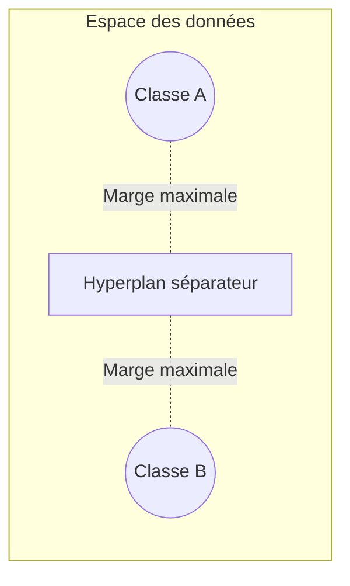

## Introduction

Ce chapitre détaille deux algorithmes aux principes géométriques distincts — les machines à vecteurs de support (SVM), qui séparent les classes par un hyperplan optimal, et k-plus-proches-voisins (k-NN), déjà utilisé de façon appliquée au cours Data Science Complète (chapitre 5) mais jamais expliqué dans son détail mathématique.

## Les Support Vector Machines — séparer par un hyperplan maximal

<CehCallout>
Une SVM cherche l'hyperplan (rappel du cours Algèbre Linéaire, chapitre 5) qui sépare deux classes en maximisant la marge — la distance entre l'hyperplan et les points les plus proches de chaque classe, appelés vecteurs de support — un principe différent de la régression logistique, qui ne cherche pas explicitement à maximiser cette marge.
</CehCallout>

<TipCallout>
Seuls les points les plus proches de la frontière (les vecteurs de support) déterminent la position de l'hyperplan — les autres points, plus éloignés, n'influencent pas le résultat final, ce qui rend les SVM relativement robustes aux points éloignés de la frontière de décision.
</TipCallout>

## Quand les données ne sont pas linéairement séparables — l'astuce du noyau

<WarningCallout>
De nombreux jeux de données réels ne peuvent pas être séparés par une simple droite ou un plan — l'astuce du noyau (kernel trick) permet de projeter implicitement les données dans un espace de dimension supérieure, où elles deviennent linéairement séparables, sans jamais calculer explicitement cette projection coûteuse.
</WarningCallout>

<CompareTable
  titleA="Noyau"
  titleB="Usage typique"
  rows={[
    { a: "Linéaire", b: "Données déjà linéairement séparables, calcul rapide" },
    { a: "Polynomial", b: "Frontières de décision courbes de complexité modérée" },
    { a: "RBF (Radial Basis Function)", b: "Frontières de décision très flexibles, le noyau le plus utilisé en pratique" },
]}
/>

## k-plus-proches-voisins — approfondissement

<CehCallout>
Rappel du cours Data Science Complète (chapitre 5) : k-NN classe un nouveau point selon la classe majoritaire parmi ses k voisins les plus proches — ce chapitre approfondit ce qui rend cet algorithme particulier : il ne construit aucun modèle pendant l'entraînement, il se contente de mémoriser l'ensemble des données (apprentissage "paresseux" ou lazy learning).
</CehCallout>

<Steps steps={[
  { title: "Calculer la distance", description: "Pour classer un nouveau point, k-NN calcule sa distance (généralement euclidienne, rappel du cours Algèbre Linéaire) à tous les points d'entraînement." },
  { title: "Sélectionner les k plus proches", description: "Les k points d'entraînement les plus proches du nouveau point sont retenus." },
  { title: "Voter", description: "La classe majoritaire parmi ces k voisins est attribuée au nouveau point." },
]} />

<WarningCallout>
Le choix de k influence fortement le résultat — un k trop petit rend le modèle sensible au bruit (une seule donnée aberrante proche peut fausser la décision) ; un k trop grand lisse excessivement la frontière de décision et peut inclure des voisins non pertinents, un compromis biais-variance similaire à celui rencontré avec la profondeur d'un arbre de décision.
</WarningCallout>

## Lab — Mise en Pratique

**Environnement** : Python 3 (terminal Nyx Shell ou environnement local avec `scikit-learn`/`pandas`/`numpy` installés)

<Steps steps={[
  { title: "Générer des données non linéairement séparables", description: "Utilise un jeu de données en forme de croissants imbriqués, l'exemple type qu'une droite ne peut pas séparer.", code: "from sklearn.datasets import make_moons\nX, y = make_moons(n_samples=100, noise=0.15, random_state=0)" },
  { title: "Tester une SVM à noyau linéaire", description: "Entraîne une SVM linéaire sur ces données et observe son score — l'hyperplan ne peut pas bien séparer des croissants.", code: "from sklearn.svm import SVC\nsvm_lin = SVC(kernel='linear').fit(X, y)\nprint('accuracy noyau lineaire:', svm_lin.score(X, y))" },
  { title: "Appliquer le kernel trick (noyau RBF)", description: "Entraîne la même SVM avec un noyau RBF et compare le score obtenu, pour constater l'effet du kernel trick évoqué plus haut.", code: "svm_rbf = SVC(kernel='rbf', gamma='scale').fit(X, y)\nprint('accuracy noyau RBF:', svm_rbf.score(X, y))" },
  { title: "Observer l'effet du choix de k en k-NN", description: "Entraîne k-NN avec un k très petit puis un k très grand sur les mêmes données et compare les scores, pour relier au compromis biais-variance vu plus haut.", code: "from sklearn.neighbors import KNeighborsClassifier\nfor k in [1, 5, 20]:\n    knn = KNeighborsClassifier(n_neighbors=k).fit(X, y)\n    print('k=', k, '-> accuracy:', knn.score(X, y))" },
]} />

## En résumé

- Une SVM cherche l'hyperplan qui maximise la marge entre les classes, déterminé uniquement par les vecteurs de support.
- L'astuce du noyau permet aux SVM de séparer des données non linéairement séparables, sans calculer explicitement une projection coûteuse.
- k-NN ne construit aucun modèle à l'entraînement — il mémorise les données et classe chaque nouveau point selon le vote de ses k plus proches voisins.

## Questions de Révision

1. Qu'est-ce qu'un vecteur de support, et pourquoi ces points déterminent-ils seuls la position de l'hyperplan ?
2. À quoi sert l'astuce du noyau (kernel trick) dans une SVM ?
3. Pourquoi k-NN est-il qualifié d'algorithme d'apprentissage "paresseux" (lazy learning) ?
