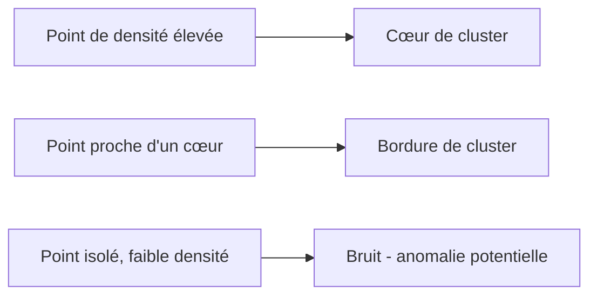
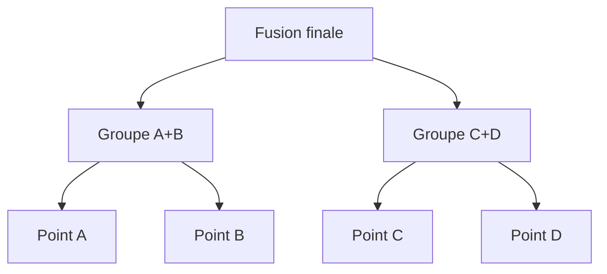

## Introduction

Ce chapitre approfondit le clustering déjà introduit de façon appliquée au cours Data Science Complète (chapitre 6) — trois approches complémentaires, chacune adaptée à des formes de données différentes, un choix particulièrement pertinent pour regrouper des familles de malwares ou détecter des comportements réseau atypiques.

## k-means en détail

<CehCallout>
Rappel du cours Data Science Complète (chapitre 6) : k-means partitionne les données en k groupes en minimisant la distance entre chaque point et le centre (centroïde) de son groupe — ce chapitre détaille comment cet algorithme trouve itérativement ces centroïdes.
</CehCallout>

<Steps steps={[
  { title: "Initialiser k centroïdes aléatoirement", description: "k points sont choisis (souvent aléatoirement parmi les données) comme centroïdes initiaux." },
  { title: "Assigner chaque point au centroïde le plus proche", description: "Chaque point est rattaché au groupe dont le centroïde est le plus proche (distance euclidienne)." },
  { title: "Recalculer les centroïdes", description: "Chaque centroïde est repositionné à la moyenne des points de son groupe." },
  { title: "Répéter jusqu'à stabilisation", description: "Les étapes 2 et 3 se répètent jusqu'à ce que les assignations ne changent plus (convergence)." },
]} />

<WarningCallout>
k-means nécessite de choisir k à l'avance et suppose des groupes de forme sphérique et de taille comparable — deux limites importantes : un mauvais choix de k ou des groupes de forme irrégulière (en croissant, imbriqués) donnent des résultats médiocres.
</WarningCallout>

## DBSCAN — le clustering par densité

<CehCallout>
DBSCAN (Density-Based Spatial Clustering) ne nécessite pas de choisir un nombre de groupes à l'avance — il regroupe les points densément proches les uns des autres et marque comme "bruit" les points isolés, une capacité directement utile pour la détection d'anomalies (un point de bruit est potentiellement une anomalie).
</CehCallout>

<TipCallout>
Cette capacité à identifier le "bruit" distingue fondamentalement DBSCAN de k-means, qui force chaque point dans l'un des k groupes même s'il ne ressemble à aucun d'entre eux — un atout majeur pour la détection d'anomalies réseau (cours Analyse SOC, chapitre 5), où les points de bruit correspondent souvent aux comportements les plus intéressants à investiguer.
</TipCallout>

## Le clustering hiérarchique

<CehCallout>
Le clustering hiérarchique construit une hiérarchie de groupes emboîtés, visualisable sous forme de dendrogramme — un arbre qui montre à quel niveau de similarité chaque paire de groupes fusionne, permettant de choisir a posteriori le nombre de groupes en "coupant" l'arbre au niveau souhaité.
</CehCallout>

<CompareTable
  titleA="Méthode"
  titleB="Avantage distinctif"
  rows={[
    { a: "k-means", b: "Rapide, efficace sur de grands volumes, mais nécessite de fixer k à l'avance" },
    { a: "DBSCAN", b: "Détecte le bruit/les anomalies, aucune forme de groupe imposée, aucun k requis" },
    { a: "Hiérarchique", b: "Fournit une vue à tous les niveaux de granularité via le dendrogramme, mais coûteux en calcul sur de grands volumes" },
]}
/>

## Lab — Mise en Pratique

**Environnement** : Réflexion guidée (sans terminal)

<Steps steps={[
  { title: "Choisir une méthode de clustering", description: "Pour détecter des connexions réseau anormales parmi un grand volume de trafic normal, quelle méthode de clustering privilégier, et pourquoi ?" },
  { title: "Expliquer la limite de k-means", description: "Pourquoi k-means peine-t-il à regrouper correctement des données en forme de croissants imbriqués, contrairement à DBSCAN ?" },
]} />

## En résumé

- k-means partitionne itérativement les données en k groupes en minimisant la distance aux centroïdes, mais nécessite de fixer k et suppose des groupes sphériques.
- DBSCAN regroupe par densité sans nécessiter de k prédéfini, et identifie explicitement les points isolés comme du bruit — utile pour la détection d'anomalies.
- Le clustering hiérarchique construit un dendrogramme permettant de choisir le nombre de groupes après coup, à n'importe quel niveau de granularité.

## Questions de Révision

1. Quelles sont les principales étapes itératives de l'algorithme k-means ?
2. Pourquoi DBSCAN est-il particulièrement adapté à la détection d'anomalies, contrairement à k-means ?
3. Qu'est-ce qu'un dendrogramme, et quel avantage offre-t-il par rapport à k-means ?
