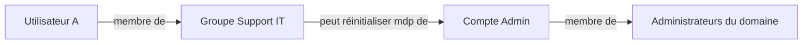

## Introduction

La théorie des graphes fournit le langage mathématique de nombreux outils de sécurité déjà rencontrés sur Nyx — BloodHound (cours Active Directory) modélise un domaine entier comme un graphe, où trouver un "chemin d'attaque" revient exactement à résoudre un problème mathématique de recherche de chemin dans un graphe.

## Vocabulaire de base

<CompareTable
  titleA="Terme"
  titleB="Définition"
  rows={[
    { a: "Nœud (ou sommet)", b: "Un élément du graphe — par exemple un utilisateur, un ordinateur ou un groupe dans Active Directory" },
    { a: "Arête (ou arc)", b: "Une relation entre deux nœuds — par exemple 'membre de', 'a une session sur', 'peut réinitialiser le mot de passe de'" },
    { a: "Chemin", b: "Une suite d'arêtes reliant un nœud de départ à un nœud d'arrivée" },
    { a: "Degré d'un nœud", b: "Le nombre de connexions (arêtes) que possède ce nœud" },
]}
/>

## Graphe orienté vs non orienté

<CehCallout>
Un graphe orienté (comme celui utilisé par BloodHound) exprime une relation à sens unique : "l'utilisateur A peut réinitialiser le mot de passe de B" ne signifie pas que B peut faire de même pour A. C'est cette directionnalité qui permet de modéliser précisément les relations de privilège asymétriques d'un domaine Active Directory.
</CehCallout>

<TipCallout>
Ce diagramme illustre exactement la logique d'un chemin d'attaque BloodHound : un attaquant compromettant l'Utilisateur A peut, en suivant chaque arête du graphe, remonter jusqu'aux droits d'Administrateur du domaine — sans jamais exploiter une seule vulnérabilité technique, uniquement des relations de privilège mal configurées.
</TipCallout>

## Trouver un chemin dans un graphe

<Steps steps={[
  { title: "Parcours en largeur (BFS)", description: "Explore le graphe niveau par niveau depuis le nœud de départ — trouve le chemin le plus court en nombre d'arêtes." },
  { title: "Parcours en profondeur (DFS)", description: "Explore une branche jusqu'au bout avant de revenir en arrière — utile pour vérifier l'existence d'un chemin, pas nécessairement le plus court." },
  { title: "Application à BloodHound", description: "L'outil calcule automatiquement le chemin le plus court entre un nœud compromis et la cible (souvent 'Administrateurs du domaine'), en explorant l'ensemble des relations collectées." },
]} />

<CehCallout>
La force de BloodHound tient précisément à l'automatisation de ce calcul de chemin sur un graphe pouvant compter des dizaines de milliers de nœuds et relations dans une grande entreprise — un travail qu'un humain ne pourrait raisonnablement pas faire manuellement, mais qu'un algorithme de parcours de graphe résout en quelques secondes.
</CehCallout>

## Le degré d'un nœud comme indicateur de risque

<WarningCallout>
Un compte avec un degré de connexions anormalement élevé dans le graphe AD (membre de nombreux groupes, ou disposant de droits sur de nombreux autres objets) constitue souvent un point de compromission à fort effet de levier — c'est exactement ce type de nœud "central" que le modèle de tiering (cours Administration Systèmes et Réseaux, chapitre 2) cherche à isoler et à protéger en priorité.
</WarningCallout>

## Lab — Mise en Pratique

**Environnement** : Réflexion guidée (sans terminal)

<Steps steps={[
  { title: "Modéliser une relation en graphe", description: "Représente sous forme de graphe orienté simple (nœuds + arêtes) la situation suivante : 'Alice est membre du groupe Support', 'le groupe Support peut réinitialiser le mot de passe de Bob', 'Bob est membre des Administrateurs du domaine'." },
  { title: "Identifier un nœud à risque", description: "Dans le graphe précédent, quel nœud faudrait-il surveiller ou protéger en priorité pour empêcher ce chemin d'attaque, et pourquoi ?" },
]} />

## En résumé

- Un graphe est composé de nœuds (éléments) et d'arêtes (relations), orientées ou non selon la nature de la relation modélisée.
- BloodHound modélise un domaine Active Directory comme un graphe orienté et calcule automatiquement les chemins d'attaque possibles.
- Un nœud au degré de connexions élevé dans un graphe de privilèges représente souvent un point de compromission à fort effet de levier.

## Questions de Révision

1. Pourquoi un graphe orienté est-il nécessaire pour modéliser fidèlement les relations de privilège dans Active Directory ?
2. Quelle est la différence entre un parcours en largeur (BFS) et un parcours en profondeur (DFS) ?
3. Pourquoi un nœud au degré de connexions anormalement élevé dans un graphe AD mérite-t-il une attention particulière ?
