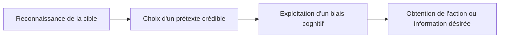

## Introduction

Après plusieurs cours consacrés à des vulnérabilités techniques (web, réseau, Active Directory), ce cours aborde la vulnérabilité la plus universellement exploitée en cybersécurité : l'humain lui-même. Aucun pare-feu ni chiffrement ne protège contre un employé convaincu d'ouvrir une pièce jointe par un attaquant habile.

## Pourquoi l'humain reste le vecteur le plus exploité

<CehCallout>
De nombreuses études sectorielles citées par l'industrie de la cybersécurité placent le facteur humain (phishing, erreur de configuration, ingénierie sociale) parmi les causes premières les plus fréquentes des compromissions réussies — souvent devant l'exploitation de vulnérabilités techniques pures, largement contrées par les correctifs, pare-feux et durcissements déjà étudiés dans les cours précédents.
</CehCallout>

<CompareTable
  titleA="Vulnérabilité technique"
  titleB="Vulnérabilité humaine (ingénierie sociale)"
  rows={[
    { a: "Corrigée par un correctif de sécurité", b: "Ne se \"corrige\" jamais définitivement — les biais cognitifs sont universels et permanents" },
    { a: "Détectable par un scan automatisé", b: "Difficile à détecter techniquement, se joue dans l'interaction humaine" },
    { a: "Coût d'exploitation souvent technique et complexe", b: "Coût d'exploitation souvent faible : un appel téléphonique ou un email suffit" },
]}
/>

## Le principe général de l'ingénierie sociale

<CehCallout>
L'ingénierie sociale consiste à manipuler une personne pour qu'elle réalise une action ou divulgue une information qu'elle n'aurait pas faite ou communiquée dans des circonstances normales — en exploitant des mécanismes psychologiques universels plutôt qu'une faille technique.
</CehCallout>

<TipCallout>
Ce schéma rejoint directement la méthodologie de reconnaissance déjà vue au cours Cybersécurité Offensive — un ingénieur social efficace collecte d'abord des informations sur sa cible (réseaux sociaux, organigramme, actualité de l'entreprise) avant de choisir le prétexte le plus crédible possible.
</TipCallout>

## Ce cours n'enseigne pas à manipuler, mais à comprendre pour défendre

<WarningCallout>
L'objectif de ce cours est strictement défensif et pédagogique : comprendre les mécanismes de manipulation pour mieux former les utilisateurs et concevoir des défenses efficaces, jamais pour les exploiter à des fins malveillantes — un principe qui rejoint directement le cadre légal du hacking éthique vu au cours Droit et Réglementation (chapitre 1), où l'ingénierie sociale ne peut être pratiquée que dans le cadre strict d'une autorisation écrite explicite.
</WarningCallout>

## Lab — Mise en Pratique

**Environnement** : Réflexion guidée (sans terminal)

<Steps steps={[
  { title: "Comparer deux vulnérabilités", description: "Pourquoi une vulnérabilité technique (comme une injection SQL) peut-elle être définitivement corrigée, alors qu'une vulnérabilité humaine (susceptibilité à l'urgence) ne le peut jamais totalement ?" },
  { title: "Identifier un vecteur à faible coût", description: "Pourquoi un simple appel téléphonique bien préparé peut-il parfois être plus efficace qu'une attaque technique complexe pour obtenir un accès initial ?" },
]} />

## En résumé

- L'humain reste le vecteur d'attaque le plus exploité, souvent devant les vulnérabilités techniques pures, largement contrées par les défenses déjà étudiées.
- L'ingénierie sociale manipule une personne via des mécanismes psychologiques universels, pas une faille technique.
- Ce cours a un objectif strictement défensif et pédagogique, dans le respect du cadre légal du hacking éthique.

## Questions de Révision

1. Pourquoi une vulnérabilité humaine ne peut-elle jamais être "corrigée" définitivement, contrairement à une vulnérabilité technique ?
2. Quelles sont les trois grandes étapes du schéma général d'une attaque d'ingénierie sociale ?
3. Pourquoi l'ingénierie sociale ne peut-elle être pratiquée légalement que dans le cadre d'une autorisation écrite explicite ?
