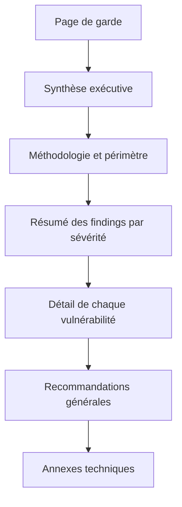

## Introduction

Ce chapitre détaille la structure canonique d'un rapport de pentest — celle utilisée (avec des variations mineures) par la quasi-totalité des cabinets de conseil en cybersécurité et exigée dans les certifications comme l'OSCP. Maîtriser cette structure permet de ne jamais repartir d'une page blanche.

## Le plan type d'un rapport de pentest



<Steps steps={[
  { title: "Page de garde", description: "Nom du client, dates du test, version du document, mention de confidentialité, auteurs." },
  { title: "Synthèse exécutive (1 page maximum)", description: "Contexte de la mission, nombre de vulnérabilités par sévérité, verdict global, sans jargon technique." },
  { title: "Méthodologie et périmètre", description: "Ce qui a été testé, ce qui ne l'a PAS été, dates, adresses IP/domaines, type de test (boîte noire/grise/blanche)." },
  { title: "Résumé des findings", description: "Tableau récapitulatif : titre, sévérité, statut (nouveau/déjà connu), composant concerné." },
  { title: "Détail de chaque vulnérabilité", description: "Une fiche complète par vulnérabilité (voir chapitre 3)." },
  { title: "Recommandations générales", description: "Au-delà du correctif ponctuel : tendances observées, axes d'amélioration structurels." },
  { title: "Annexes techniques", description: "Sorties d'outils complètes (nmap, burp, sqlmap), logs, captures — pour l'équipe qui doit corriger." },
]} />

## La synthèse exécutive — l'endroit qui compte le plus

<CehCallout>
La synthèse exécutive est statistiquement la partie la plus lue d'un rapport — parfois la seule lue par la direction. Une synthèse mal écrite peut faire échouer un audit pourtant techniquement excellent, en ne réussissant pas à convaincre de l'urgence des corrections.
</CehCallout>

Une bonne synthèse exécutive répond, dans l'ordre, à ces questions :

1. Qu'est-ce qui a été testé, et pourquoi ?
2. Quel est le niveau de risque global (en une phrase) ?
3. Combien de vulnérabilités par sévérité (tableau ou graphique simple) ?
4. Quelle est la recommandation prioritaire n°1 ?

```text
Exemple de synthèse exécutive :

Entre le 3 et le 10 mars 2026, [Cabinet] a réalisé un test d'intrusion en boîte grise
sur l'application web de gestion commerciale de [Client]. Ce test a révélé une
vulnérabilité critique (injection SQL permettant l'extraction de la base clients)
ainsi que 4 vulnérabilités de sévérité moyenne liées à la gestion des sessions.

Niveau de risque global : ÉLEVÉ. La vulnérabilité critique doit être corrigée
avant toute mise en production, dans un délai maximal de 5 jours ouvrés.
```

<TipCallout>
Écris toujours la synthèse exécutive en dernier, une fois le rapport complet rédigé — c'est la seule façon de garantir qu'elle reflète fidèlement l'ensemble des findings, y compris ceux découverts tardivement dans la mission.
</TipCallout>

## Corps du rapport vs annexes — où mettre quoi

<CompareTable
  titleA="Dans le corps du rapport"
  titleB="En annexe technique"
  rows={[
    { a: "Description de la vulnérabilité en langage clair", b: "Sortie brute complète de sqlmap/burp/nmap" },
    { a: "Une capture d'écran illustrant l'impact", b: "L'intégralité des requêtes/réponses HTTP capturées" },
    { a: "Le score CVSS et sa justification résumée", b: "Le détail complet du calcul vectoriel CVSS" },
    { a: "La recommandation de correctif", b: "Des exemples de code corrigé si pertinent" },
  ]}
/>

<AuditCallout>
Dans un audit ISO 27001, l'auditeur applique le même principe de séparation : le rapport d'audit présente les non-conformités et leur impact, tandis que les preuves d'audit (captures, extraits de logs, entretiens) sont archivées séparément et référencées, pas noyées dans le corps du texte.
</AuditCallout>

## Lab — Mise en Pratique

**Environnement** : Réflexion guidée (sans terminal)

<Steps steps={[
  { title: "Rédiger une synthèse exécutive", description: "À partir des résultats du lab web-001 (SQLi, webshell, privesc) que tu as réalisé sur Nyx, rédige une synthèse exécutive de 8 lignes maximum, sans jargon technique." },
  { title: "Trier corps vs annexe", description: "Pour les éléments suivants, indique s'ils vont dans le corps du rapport ou en annexe : capture d'écran du panneau admin compromis, sortie complète de 'nmap -A', tableau récapitulatif des findings, dump complet de sqlmap --dump." },
]} />

## En résumé

- Un rapport de pentest suit un plan type : garde, synthèse exécutive, méthodologie, résumé, détail des vulnérabilités, recommandations, annexes.
- La synthèse exécutive, rédigée en dernier, est souvent la partie la plus lue du document.
- Le corps du rapport reste lisible sans jargon ; les preuves brutes et volumineuses vont en annexe.

## Questions de Révision

1. Pourquoi vaut-il mieux rédiger la synthèse exécutive en dernier ?
2. Cite les trois premières sections d'un rapport de pentest professionnel.
3. Donne un exemple d'élément qui doit aller en annexe plutôt que dans le corps du rapport.
