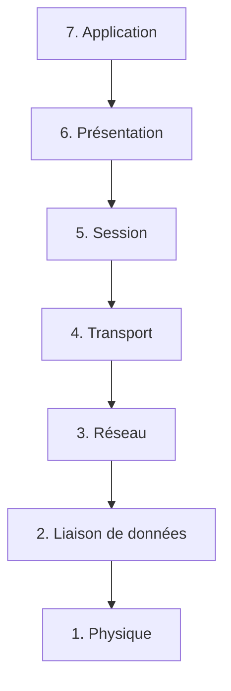

## Introduction

Tout ce que tu feras en pentest réseau, en analyse de trafic ou en durcissement de serveur repose sur un principe simple : les communications réseau sont découpées en couches, chacune avec sa responsabilité propre. Comprendre ces couches n'est pas un exercice académique — c'est ce qui te permet de savoir immédiatement où chercher quand un outil ne fonctionne pas, ou à quel niveau se situe une vulnérabilité.

Ce chapitre présente le modèle OSI (7 couches, théorique et pédagogique) et le modèle TCP/IP (4 couches, celui réellement implémenté sur Internet).

## Le modèle OSI en 7 couches



<CompareTable
  titleA="Couche OSI"
  titleB="Exemple / Protocole"
  rows={[
    { a: "7. Application", b: "HTTP, DNS, SSH, FTP" },
    { a: "6. Présentation", b: "Chiffrement TLS, encodage des données" },
    { a: "5. Session", b: "Établissement/maintien de sessions (NetBIOS, RPC)" },
    { a: "4. Transport", b: "TCP, UDP" },
    { a: "3. Réseau", b: "IP, ICMP, routage" },
    { a: "2. Liaison de données", b: "Ethernet, adresses MAC, switches" },
    { a: "1. Physique", b: "Câbles, signaux électriques/optiques, Wi-Fi" },
  ]}
/>

<TipCallout>
Moyen mnémotechnique classique pour retenir l'ordre des couches (de 7 à 1) : "**A**ll **P**eople **S**eem **T**o **N**eed **D**ata **P**rocessing" — Application, Présentation, Session, Transport, Réseau (Network), Liaison (Data), Physique.
</TipCallout>

## Le modèle TCP/IP (celui réellement utilisé)

En pratique, Internet ne suit pas strictement les 7 couches OSI : le modèle TCP/IP, plus simple, en compte 4.

<CompareTable
  titleA="Couche TCP/IP"
  titleB="Équivalent OSI"
  rows={[
    { a: "Application", b: "Application + Présentation + Session (couches 7, 6, 5)" },
    { a: "Transport", b: "Transport (couche 4)" },
    { a: "Internet", b: "Réseau (couche 3)" },
    { a: "Accès réseau", b: "Liaison de données + Physique (couches 2, 1)" },
  ]}
/>

<CehCallout>
Le CEH utilise principalement le modèle OSI pour catégoriser les attaques (ex : ARP spoofing = couche 2, IP spoofing = couche 3, TCP SYN flood = couche 4). C'est le référentiel commun de tout le domaine.
</CehCallout>

## Encapsulation : comment les données voyagent

À chaque couche descendante, les données sont encapsulées dans un en-tête supplémentaire — ce principe s'appelle l'encapsulation.

<Steps steps={[
  { title: "Couche Application", description: "Les données de ton navigateur (une requête HTTP) sont créées." },
  { title: "Couche Transport", description: "Un en-tête TCP est ajouté (ports source/destination, numéro de séquence)." },
  { title: "Couche Internet", description: "Un en-tête IP est ajouté (adresses IP source/destination)." },
  { title: "Couche Accès réseau", description: "Un en-tête Ethernet est ajouté (adresses MAC), prêt à être transmis physiquement." },
]} />

<WarningCallout>
Cette encapsulation est directement exploitable en attaque : le spoofing consiste précisément à falsifier un en-tête à une couche donnée (adresse MAC en couche 2, adresse IP en couche 3) pour tromper un équipement réseau.
</WarningCallout>

## Lab — Mise en Pratique

**Environnement** : Kali Linux (terminal Nyx Shell)

<Steps steps={[
  { title: "Observer l'encapsulation en direct", description: "Capture quelques paquets et observe les en-têtes Ethernet, IP et TCP superposés.", code: "tcpdump -i any -c 5 -X" },
  { title: "Identifier ta couche 2", description: "Affiche ton adresse MAC (couche liaison de données).", code: "ip link show" },
  { title: "Identifier ta couche 3", description: "Affiche ton adresse IP (couche réseau).", code: "ip addr show" },
]} />

## Pour aller plus loin

### Lire une trame réseau octet par octet

Comprendre l'encapsulation en théorie est une chose ; savoir la reconnaître dans une capture hexadécimale brute en est une autre — une compétence directement utile en analyse forensique réseau.

```text
Extrait d'une trame Ethernet capturée (tcpdump -X) :
0x0000:  aabb cc00 1122 aabb cc33 4455 0800 4500   .....".3DU..E.
         └─ MAC destination ─┘└─ MAC source ──┘└Type┘└─ IP ─
0x0010:  003c 1c46 4000 4006 b1e6 c0a8 0101 c0a8   .<.F@.@.........
                                └IP src┘└IP dst┘
```

<TipCallout>
Le champ EtherType `0800` (en hexadécimal) juste après les adresses MAC indique que la charge utile est un paquet IPv4 — `86DD` indiquerait de l'IPv6, `0806` de l'ARP. Repérer ce champ permet d'identifier immédiatement le protocole de couche 3 sans même lire l'en-tête IP.
</TipCallout>

### Le modèle hybride réel : 5 couches

En pratique pédagogique, beaucoup de formations (dont le CEH) utilisent un modèle hybride à 5 couches, qui reprend les 3 couches hautes du modèle OSI simplifiées en une seule "Application", mais détaille explicitement Transport, Réseau, Liaison et Physique séparément — un compromis entre la simplicité du TCP/IP à 4 couches et la précision de l'OSI à 7 couches. Ne sois donc pas surpris si certains supports de cours ou certifications présentent un découpage légèrement différent : le vocabulaire des couches Transport/Réseau/Liaison/Physique reste stable, seule la partie haute (Application) varie dans son niveau de détail.

### Chaque outil de pentest à sa couche

Relier systématiquement un outil à sa couche OSI aide à structurer ta méthodologie de reconnaissance :

<CompareTable
  titleA="Couche"
  titleB="Outils typiques"
  rows={[
    { a: "2 - Liaison de données", b: "arp-scan, ettercap, macof (attaques ARP/MAC)" },
    { a: "3 - Réseau", b: "ping, traceroute, hping3 (manipulation de paquets IP/ICMP)" },
    { a: "4 - Transport", b: "Nmap (scan TCP/UDP), hping3 (SYN flood de test)" },
    { a: "7 - Application", b: "Burp Suite, sqlmap, gobuster (tout ce qui parle HTTP/DNS/SSH directement)" },
  ]}
/>

<CehCallout>
Face à un outil inconnu, la première question à te poser est "à quelle couche opère-t-il ?" — cela détermine immédiatement le type d'information qu'il peut révéler et les protections qui peuvent le contrer.
</CehCallout>

## En résumé

- Le modèle OSI (7 couches) est le référentiel pédagogique de toute analyse réseau et de sécurité.
- Le modèle TCP/IP (4 couches), plus simple, est celui réellement implémenté sur Internet.
- Chaque couche descendante encapsule les données de la couche du dessus dans un nouvel en-tête.
- De nombreuses attaques réseau se définissent précisément par la couche OSI qu'elles ciblent.

## Questions de Révision

1. Combien de couches compte le modèle OSI, et combien le modèle TCP/IP ?
2. À quelle couche OSI se situe une attaque ARP spoofing ?
3. Qu'est-ce que l'encapsulation dans le contexte des réseaux ?
