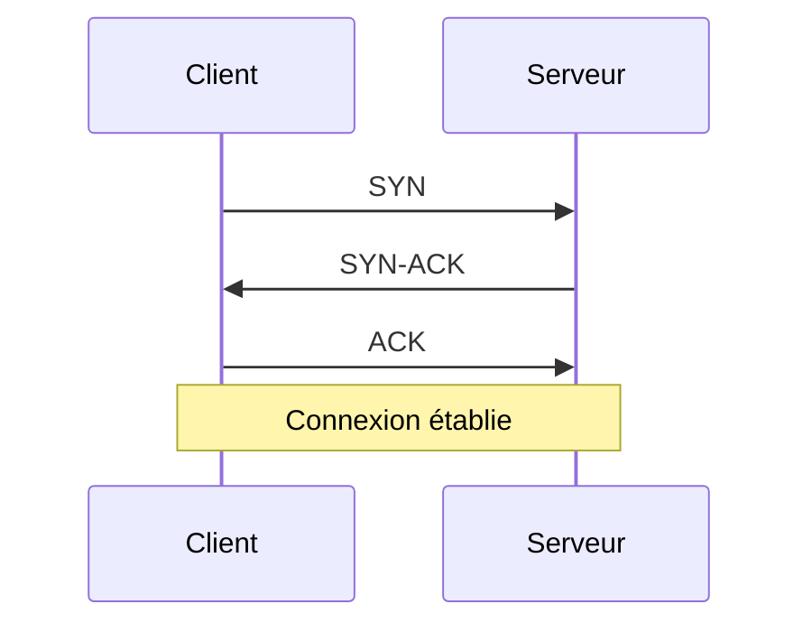

## Introduction

Nmap, le premier outil que tout pentester apprend à maîtriser, repose entièrement sur la compréhension de TCP et UDP. Savoir interpréter un scan de ports suppose de comprendre ce qui se passe réellement au niveau de la couche transport — ce chapitre pose ces bases.

## TCP : fiable, orienté connexion

TCP (Transmission Control Protocol) garantit la livraison ordonnée et sans perte des données, via un mécanisme d'établissement de connexion en trois temps : le **three-way handshake**.



<CehCallout>
Le scan Nmap par défaut (`-sS`, SYN scan) exploite directement ce mécanisme : il envoie un SYN et observe la réponse (SYN-ACK = port ouvert, RST = port fermé) sans compléter le handshake — d'où son nom de "scan furtif" (half-open scan).
</CehCallout>

## UDP : rapide, sans connexion

UDP (User Datagram Protocol) n'établit aucune connexion préalable et ne garantit ni l'ordre ni la livraison des paquets — en échange d'une latence bien plus faible.

<CompareTable
  titleA="TCP"
  titleB="UDP"
  rows={[
    { a: "Orienté connexion (handshake)", b: "Sans connexion" },
    { a: "Livraison garantie et ordonnée", b: "Aucune garantie de livraison" },
    { a: "Plus lent (overhead du contrôle)", b: "Plus rapide, faible latence" },
    { a: "HTTP, SSH, FTP, SMTP", b: "DNS, DHCP, streaming vidéo, VoIP" },
  ]}
/>

<TipCallout>
Le scan UDP (`nmap -sU`) est nettement plus lent et moins fiable que le scan TCP, car l'absence de réponse à un paquet UDP est ambiguë : port ouvert sans réponse applicative, ou paquet filtré par un pare-feu ? Nmap doit souvent réessayer plusieurs fois.
</TipCallout>

## Ports courants à connaître

<CompareTable
  titleA="Port"
  titleB="Service"
  rows={[
    { a: "21 (TCP)", b: "FTP" },
    { a: "22 (TCP)", b: "SSH" },
    { a: "23 (TCP)", b: "Telnet (non chiffré, obsolète)" },
    { a: "25 (TCP)", b: "SMTP" },
    { a: "53 (TCP/UDP)", b: "DNS" },
    { a: "80 (TCP)", b: "HTTP" },
    { a: "443 (TCP)", b: "HTTPS" },
    { a: "445 (TCP)", b: "SMB (partage de fichiers Windows)" },
    { a: "3389 (TCP)", b: "RDP (Bureau à distance Windows)" },
  ]}
/>

<WarningCallout>
Un service tournant sur un port non standard (ex. SSH sur le port 2222) n'est pas invisible : un scan complet (`-p-`) le détectera de toute façon. La sécurité par l'obscurité (changer un port sans autre mesure) ne remplace jamais un vrai durcissement.
</WarningCallout>

## Lab — Mise en Pratique

**Environnement** : Kali Linux (terminal Nyx Shell)

<Steps steps={[
  { title: "Observer le three-way handshake", description: "Capture le handshake TCP en te connectant à un service distant.", code: "tcpdump -i any 'tcp[tcpflags] & (tcp-syn|tcp-ack) != 0' -c 6" },
  { title: "Scanner les ports TCP courants", description: "Lance un scan SYN sur les ports les plus utilisés d'une cible.", code: "nmap -sS --top-ports 20 10.10.0.10" },
  { title: "Scanner les ports UDP courants", description: "Effectue la même chose en UDP et compare la durée du scan.", code: "nmap -sU --top-ports 20 10.10.0.10" },
]} />

## Pour aller plus loin

### Les différents types de scan Nmap et leur signature réseau

Au-delà du SYN scan par défaut, Nmap propose plusieurs techniques, chacune avec une signature réseau différente — utile à connaître aussi bien pour scanner discrètement que pour détecter un scan côté défense.

<CompareTable
  titleA="Type de scan"
  titleB="Comportement réseau"
  rows={[
    { a: "-sS (SYN scan)", b: "Half-open : SYN puis RST si port ouvert, jamais de connexion complète" },
    { a: "-sT (Connect scan)", b: "Handshake TCP complet — plus lent, mais ne nécessite pas de privilèges root" },
    { a: "-sF (FIN scan)", b: "Envoie un paquet FIN seul ; certains systèmes répondent différemment selon l'état du port, utile pour contourner des pare-feu basiques" },
    { a: "-sA (ACK scan)", b: "Ne détecte pas l'état du port mais la présence d'un filtrage (pare-feu stateful ou non)" },
]}
/>

<CehCallout>
Le Connect scan (`-sT`) laisse une trace bien plus visible dans les logs applicatifs qu'un SYN scan, puisque la connexion TCP est réellement établie — un point souvent testé au CEH sur la furtivité relative des différentes techniques.
</CehCallout>

### Comprendre le RTT et l'impact sur la vitesse de scan

Nmap adapte dynamiquement sa vitesse de scan au temps de réponse (RTT — Round Trip Time) de la cible et aux templates de timing (`-T0` à `-T5`).

```bash
# Timing très prudent (utile pour éviter la détection IDS, mais très lent)
nmap -T1 -p- 10.10.0.10

# Timing agressif (rapide, mais plus détectable et risque de faux négatifs)
nmap -T4 -p- 10.10.0.10
```

<TipCallout>
`-T4` est un bon compromis par défaut sur un réseau local fiable (comme un lab Nyx) ; réserve `-T1`/`-T2` aux contextes où la discrétion prime réellement sur la vitesse, par exemple un test d'intrusion en boîte noire avec surveillance active.
</TipCallout>

### Ports supplémentaires fréquemment ciblés en pentest

Au-delà des ports "grand public" déjà vus, quelques ports reviennent très souvent en reconnaissance offensive :

<CompareTable
  titleA="Port"
  titleB="Service / intérêt en pentest"
  rows={[
    { a: "139 (TCP)", b: "NetBIOS Session Service — souvent associé au 445/SMB" },
    { a: "389 / 636 (TCP)", b: "LDAP / LDAPS — annuaire Active Directory" },
    { a: "1433 (TCP)", b: "Microsoft SQL Server" },
    { a: "3306 (TCP)", b: "MySQL / MariaDB" },
    { a: "5985 / 5986 (TCP)", b: "WinRM — administration à distance Windows" },
]}
/>

## En résumé

- TCP garantit une livraison fiable et ordonnée via le three-way handshake (SYN, SYN-ACK, ACK).
- UDP privilégie la rapidité sans garantie de livraison — utilisé par DNS, DHCP, streaming.
- Le SYN scan de Nmap exploite directement le handshake TCP sans le compléter.
- Le scan UDP est plus lent et moins fiable car l'absence de réponse est ambiguë.

## Questions de Révision

1. Quelles sont les trois étapes du three-way handshake TCP ?
2. Pourquoi le scan UDP est-il plus lent et moins fiable que le scan TCP ?
3. Sur quel port standard tourne le service SMB ?
