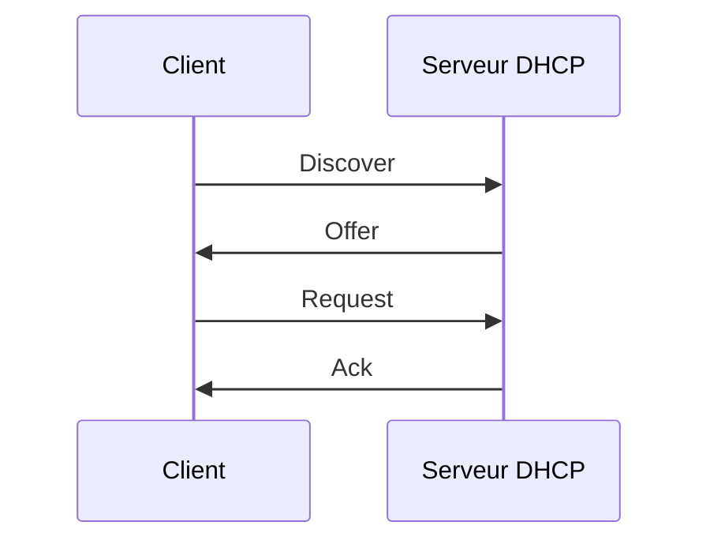

## Introduction

Trois protocoles applicatifs structurent la quasi-totalité de ta navigation quotidienne et de tes futures phases de reconnaissance : HTTP (le web), DNS (la résolution de noms) et DHCP (l'attribution d'adresses). Ce chapitre les couvre chacun avec un focus sécurité.

## HTTP : le protocole du web

HTTP est un protocole texte, sans état, basé sur des requêtes et des réponses.

```
GET /produits?id=42 HTTP/1.1
Host: shop.lab
User-Agent: Mozilla/5.0
Cookie: session=abc123
```

<CompareTable
  titleA="Code de statut"
  titleB="Signification"
  rows={[
    { a: "200 OK", b: "Requête traitée avec succès" },
    { a: "301 / 302", b: "Redirection permanente / temporaire" },
    { a: "401 / 403", b: "Non authentifié / Accès refusé" },
    { a: "404", b: "Ressource introuvable" },
    { a: "500", b: "Erreur serveur interne" },
  ]}
/>

<CehCallout>
Les en-têtes HTTP de réponse (`Server`, `X-Powered-By`) révèlent souvent la stack technique d'une cible — une information précieuse en reconnaissance, mais aussi la première chose à masquer ou neutraliser côté défense.
</CehCallout>

## DNS : la résolution de noms

DNS traduit un nom de domaine humainement lisible en adresse IP.

<CompareTable
  titleA="Type d'enregistrement"
  titleB="Rôle"
  rows={[
    { a: "A", b: "Associe un nom de domaine à une adresse IPv4" },
    { a: "AAAA", b: "Associe un nom de domaine à une adresse IPv6" },
    { a: "MX", b: "Serveur de messagerie du domaine" },
    { a: "NS", b: "Serveurs de noms faisant autorité sur le domaine" },
    { a: "TXT", b: "Données arbitraires (SPF, vérification de domaine...)" },
    { a: "CNAME", b: "Alias vers un autre nom de domaine" },
  ]}
/>

```bash
# Interroger différents types d'enregistrements
dig example.com A
dig example.com MX
dig example.com NS
```

<TipCallout>
Une requête `dig example.com ANY` (ou une énumération de sous-domaines) fait partie des premiers réflexes OSINT en reconnaissance passive — elle peut révéler des sous-domaines de test ou d'administration non destinés au public.
</TipCallout>

## DHCP : attribution dynamique d'adresses

DHCP (Dynamic Host Configuration Protocol) attribue automatiquement une adresse IP, un masque, une passerelle et des serveurs DNS à une machine qui rejoint le réseau, via un échange en 4 étapes (DORA).



<WarningCallout>
Un serveur DHCP non autorisé (rogue DHCP) installé sur un réseau peut rediriger tout le trafic des victimes vers une passerelle ou des DNS malveillants. C'est une attaque de couche 2 redoutable en environnement d'entreprise mal segmenté.
</WarningCallout>

<AuditCallout>
La détection de serveurs DHCP non autorisés (DHCP snooping) est une fonctionnalité standard des switches d'entreprise et un contrôle recommandé par la plupart des référentiels de durcissement réseau.
</AuditCallout>

## Lab — Mise en Pratique

**Environnement** : Kali Linux (terminal Nyx Shell)

<Steps steps={[
  { title: "Analyser une requête HTTP brute", description: "Récupère les en-têtes de réponse d'un serveur pour identifier sa stack technique.", code: "curl -I http://10.10.0.10" },
  { title: "Interroger différents enregistrements DNS", description: "Récupère les enregistrements A, MX et NS d'un domaine.", code: "dig example.com A MX NS" },
  { title: "Observer le bail DHCP courant", description: "Affiche les informations d'attribution DHCP de ton interface.", code: "ip addr show && cat /var/lib/dhcp/dhclient.leases 2>/dev/null" },
]} />

## Pour aller plus loin

### HTTPS et TLS : chiffrer ce que HTTP expose en clair

HTTP transmet tout en clair — identifiants, cookies de session, contenu — ce qui en fait une cible directe pour l'interception réseau. **TLS** (Transport Layer Security) ajoute une couche de chiffrement, formant HTTPS.

```bash
# Examiner le certificat TLS d'un serveur
openssl s_client -connect example.com:443 -showcerts

# Vérifier rapidement la date d'expiration d'un certificat
echo | openssl s_client -connect example.com:443 2>/dev/null | openssl x509 -noout -dates
```

<WarningCallout>
Un certificat expiré, auto-signé ou émis pour un autre domaine déclenche une alerte navigateur — mais cela ne signifie pas absence de chiffrement : le trafic peut rester chiffré tout en étant vulnérable à un Man-in-the-Middle si l'utilisateur ignore l'avertissement.
</WarningCallout>

### DNSSEC : signer les réponses DNS

Le DNS classique n'authentifie pas ses réponses, ce qui permet le DNS spoofing (vu au dernier chapitre de ce cours). **DNSSEC** ajoute une signature cryptographique aux enregistrements, permettant au client de vérifier qu'une réponse provient bien du serveur légitime et n'a pas été altérée en chemin.

```bash
# Vérifier si un domaine utilise DNSSEC
dig example.com DNSKEY
dig +dnssec example.com A
```

<AuditCallout>
Malgré son intérêt évident, DNSSEC reste encore peu déployé à grande échelle en 2026 — un point que les auditeurs de sécurité relèvent régulièrement comme axe d'amélioration lors des audits d'infrastructure DNS.
</AuditCallout>

### Énumération DNS active : au-delà du dig simple

En reconnaissance active, l'énumération de sous-domaines dépasse largement quelques requêtes `dig` manuelles :

```bash
# Brute-force de sous-domaines avec une wordlist
gobuster dns -d example.com -w /usr/share/wordlists/subdomains.txt

# Transfert de zone (souvent mal configuré = fuite de tout l'annuaire DNS interne)
dig axfr @ns1.example.com example.com
```

<CehCallout>
Un transfert de zone DNS non restreint (AXFR ouvert à quiconque) est une mauvaise configuration classique qui révèle d'un coup l'intégralité des enregistrements d'un domaine — un des tout premiers tests à effectuer en reconnaissance DNS active.
</CehCallout>

## En résumé

- HTTP structure les échanges web en requêtes/réponses avec des codes de statut normalisés.
- DNS traduit les noms de domaine en adresses IP via différents types d'enregistrements (A, MX, NS, TXT).
- DHCP attribue automatiquement la configuration réseau via l'échange Discover/Offer/Request/Ack (DORA).
- Un serveur DHCP non autorisé (rogue DHCP) est une attaque de couche 2 à prendre au sérieux.

## Questions de Révision

1. Que signifie le code HTTP 403 ?
2. Quel type d'enregistrement DNS indique le serveur de messagerie d'un domaine ?
3. Quelles sont les 4 étapes de l'échange DHCP (DORA) ?
