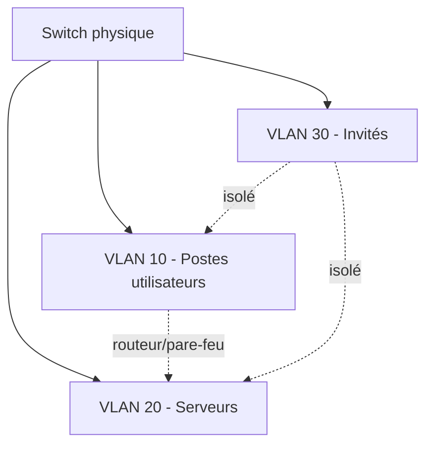

## Introduction

La topologie physique et logique d'un réseau détermine directement sa surface d'attaque : un réseau plat, sans segmentation, permet à un attaquant ayant compromis une seule machine d'atteindre potentiellement tout le système d'information. Ce chapitre couvre les équipements de base et le principe de segmentation par VLAN.

## Switch, routeur, point d'accès : qui fait quoi

<CompareTable
  titleA="Équipement"
  titleB="Rôle"
  rows={[
    { a: "Switch (commutateur)", b: "Relie des machines au sein d'un même réseau local, au niveau de la couche 2 (adresses MAC)" },
    { a: "Routeur", b: "Relie des réseaux différents entre eux, au niveau de la couche 3 (adresses IP)" },
    { a: "Point d'accès Wi-Fi", b: "Étend un réseau local via une liaison sans fil (souvent combiné à un switch/routeur)" },
    { a: "Pare-feu", b: "Filtre le trafic entre zones réseau selon des règles de sécurité" },
  ]}
/>

<TipCallout>
Un switch fonctionne par défaut en "diffusion" au sein d'un même VLAN : toute trame dont l'adresse MAC destination est inconnue est envoyée sur tous les ports. C'est ce comportement qu'exploitent certaines attaques d'écoute (MAC flooding).
</TipCallout>

## Les VLANs : segmenter un réseau physique en réseaux logiques

Un VLAN (Virtual LAN) permet de créer plusieurs réseaux logiquement séparés sur une même infrastructure physique — les machines d'un VLAN ne peuvent pas communiquer directement avec celles d'un autre VLAN sans passer par un routeur ou un pare-feu.



<AttackDefenseTable rows={[
  { phase: "Mouvement latéral", attack: "Un poste utilisateur compromis tente d'atteindre directement les serveurs", defense: "VLAN dédié aux serveurs avec règles de pare-feu strictes entre VLANs" },
  { phase: "Réseau invité", attack: "Un visiteur connecté au Wi-Fi invité scanne le réseau interne", defense: "VLAN invité totalement isolé du reste du système d'information" },
  { phase: "VLAN hopping", attack: "Un attaquant exploite une mauvaise configuration de trunk pour sauter d'un VLAN à un autre", defense: "Désactiver le trunking automatique (DTP) sur les ports non nécessaires" },
]} />

<CehCallout>
Le VLAN hopping (via double tagging 802.1Q ou usurpation de switch) est une attaque de couche 2 classique du référentiel CEH — elle illustre qu'un VLAN seul n'est pas une mesure de sécurité absolue si la configuration des trunks est négligée.
</CehCallout>

## Zones réseau et principe de moindre exposition

Une architecture réseau sécurisée type sépare généralement au minimum :

- **Zone utilisateurs** : postes de travail
- **Zone serveurs** : applications métier, bases de données
- **DMZ (zone démilitarisée)** : services exposés publiquement (site web, mail)
- **Zone d'administration** : accès privilégiés, isolée et fortement contrôlée

<AuditCallout>
Cette logique de zonage correspond directement au principe de "defense in depth" et au contrôle A.13.1 (sécurité des réseaux) de la norme ISO 27001 — la segmentation réseau est l'une des mesures les plus citées lors d'un audit.
</AuditCallout>

## Lab — Mise en Pratique

**Environnement** : Réflexion guidée + Kali Linux (terminal Nyx Shell)

<Steps steps={[
  { title: "Cartographier une architecture", description: "Pour une PME avec 50 postes, 5 serveurs internes et un site web public, propose un découpage en VLANs cohérent." },
  { title: "Observer les tables ARP locales", description: "Liste les machines visibles sur ton segment réseau actuel.", code: "arp -a" },
  { title: "Identifier le risque d'un réseau plat", description: "Explique en 3 phrases pourquoi l'absence de segmentation aggrave l'impact d'un ransomware." },
]} />

## Pour aller plus loin

### Le protocole 802.1Q en détail

Le tagging VLAN repose sur la norme **802.1Q**, qui insère un champ de 4 octets dans la trame Ethernet pour identifier son VLAN d'appartenance. Comprendre sa structure aide à saisir précisément le mécanisme du VLAN hopping par double tagging.

```text
Trame Ethernet standard :   [MAC dest][MAC src][EtherType][Data]
Trame taguée 802.1Q :       [MAC dest][MAC src][Tag 802.1Q][EtherType][Data]
                                                 └─ VLAN ID (12 bits, 1-4094) ─┘
```

<CehCallout>
Le VLAN hopping par double tagging fonctionne en empilant deux tags 802.1Q : le switch d'entrée retire le tag externe (le VLAN "natif" attendu) et transmet la trame avec le tag interne intact vers un autre VLAN — une trame ne devrait jamais porter plus d'un tag légitime.
</CehCallout>

### Port security : limiter les adresses MAC par port

Au-delà des VLANs, la fonctionnalité **port security** des switches d'entreprise limite le nombre (et parfois la liste précise) d'adresses MAC autorisées sur un port physique — une défense directe contre le MAC flooding.

```text
Exemple de configuration (syntaxe Cisco, à titre illustratif) :
switchport port-security
switchport port-security maximum 2
switchport port-security violation shutdown
```

<TipCallout>
La violation "shutdown" désactive automatiquement le port dès qu'une adresse MAC non autorisée apparaît — une mesure radicale mais efficace contre le MAC flooding et le branchement non autorisé d'équipements sur le réseau filaire.
</TipCallout>

### Wi-Fi d'entreprise : WPA2/WPA3-Enterprise et le rôle du VLAN

Le Wi-Fi ajoute une dimension supplémentaire à la segmentation : un point d'accès professionnel peut diffuser plusieurs SSID, chacun mappé sur un VLAN distinct (utilisateurs, invités, IoT), avec authentification 802.1X (WPA2/WPA3-Enterprise) contre un serveur RADIUS plutôt qu'une simple clé partagée.

<AttackDefenseTable rows={[
  { phase: "Wi-Fi invité", attack: "Un SSID invité mal isolé permet d'atteindre le réseau interne", defense: "VLAN invité dédié + pare-feu strict entre ce VLAN et le reste du réseau" },
  { phase: "IoT non sécurisé", attack: "Un objet connecté compromis sert de rebond vers le réseau principal", defense: "VLAN IoT isolé, sans accès direct aux postes utilisateurs ou serveurs" },
]} />

## En résumé

- Le switch opère en couche 2 (MAC), le routeur en couche 3 (IP) pour relier des réseaux différents.
- Les VLANs permettent de segmenter logiquement un réseau physique unique.
- Une segmentation en zones (utilisateurs, serveurs, DMZ, administration) limite fortement le mouvement latéral d'un attaquant.
- Le VLAN hopping rappelle qu'une segmentation mal configurée n'est pas une garantie de sécurité.

## Questions de Révision

1. À quelle couche OSI opère un switch, et à quelle couche un routeur ?
2. Pourquoi un réseau "plat" (sans segmentation) est-il plus risqué en cas de compromission ?
3. Qu'est-ce que le VLAN hopping ?
