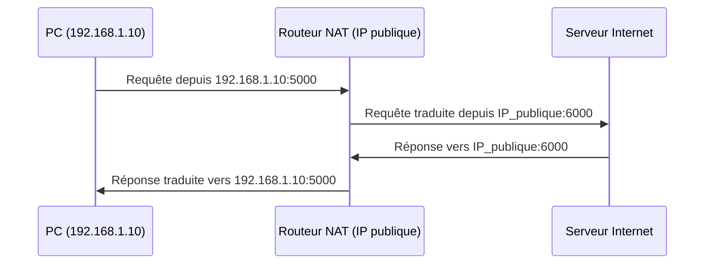

## Introduction

Ce chapitre couvre trois piliers de la sécurité réseau périmétrique : le pare-feu (qui filtre), le NAT (qui masque et traduit), et le VPN (qui chiffre et relie). Comprendre leur fonctionnement précis est indispensable pour les contourner en pentest autorisé comme pour les configurer correctement en défense.

## Les types de pare-feu

<CompareTable
  titleA="Type de pare-feu"
  titleB="Fonctionnement"
  rows={[
    { a: "Stateless (sans état)", b: "Filtre chaque paquet indépendamment selon des règles statiques (IP, port)" },
    { a: "Stateful (à état)", b: "Suit l'état des connexions établies, autorise automatiquement le trafic retour légitime" },
    { a: "Applicatif (couche 7)", b: "Analyse le contenu applicatif (WAF pour HTTP, filtrage de contenu)" },
    { a: "Next-Gen (NGFW)", b: "Combine filtrage stateful, inspection applicative, IDS/IPS intégré" },
  ]}
/>

<TipCallout>
La plupart des pare-feux modernes (iptables/nftables inclus) sont stateful : la règle `ESTABLISHED,RELATED` que tu as vue dans le cours Linux autorise justement le trafic retour d'une connexion déjà initiée, sans avoir à écrire une règle explicite dans les deux sens.
</TipCallout>

## NAT : traduction d'adresses

Le NAT (Network Address Translation) permet à plusieurs machines d'un réseau privé de partager une seule adresse IP publique pour accéder à Internet.



<CompareTable
  titleA="Type de NAT"
  titleB="Usage"
  rows={[
    { a: "NAT statique (1:1)", b: "Une IP privée est systématiquement traduite vers la même IP publique" },
    { a: "PAT / NAT overload (le plus courant)", b: "Plusieurs IP privées partagent une IP publique, distinguées par les ports" },
    { a: "Port forwarding (DNAT)", b: "Redirige un port public vers une machine/port interne spécifique (ex : exposer un serveur web)" },
  ]}
/>

<CehCallout>
Le NAT n'est pas un mécanisme de sécurité à proprement parler — il masque l'adressage interne mais ne filtre rien par lui-même. Un port forwarding mal configuré expose directement une machine interne, NAT ou non.
</CehCallout>

## VPN : chiffrer et relier

Un VPN (Virtual Private Network) crée un tunnel chiffré entre deux points, permettant de faire transiter du trafic de façon confidentielle sur un réseau non fiable (Internet public).

<CompareTable
  titleA="Type de VPN"
  titleB="Usage typique"
  rows={[
    { a: "Site-à-site", b: "Relie deux réseaux d'entreprise entre eux de façon permanente" },
    { a: "Accès distant (client-to-site)", b: "Permet à un utilisateur nomade de rejoindre le réseau de l'entreprise" },
    { a: "WireGuard / OpenVPN", b: "Solutions logicielles courantes, souvent utilisées en environnement de lab et en entreprise" },
  ]}
/>

<AuditCallout>
L'usage d'un VPN pour tout accès distant à un système d'information est une exigence quasi systématique des référentiels de sécurité (ISO 27001, recommandations ANSSI) — l'accès direct de services d'administration sur Internet sans VPN est une non-conformité fréquemment relevée en audit.
</AuditCallout>

<WarningCallout>
Un VPN chiffre le trafic mais n'authentifie pas nécessairement fortement l'utilisateur : un VPN sans MFA (authentification multifacteur) reste un point d'entrée vulnérable au vol d'identifiants — c'est l'un des vecteurs d'accès initial les plus exploités lors d'attaques par ransomware ces dernières années.
</WarningCallout>

## Lab — Mise en Pratique

**Environnement** : Kali Linux (terminal Nyx Shell)

<Steps steps={[
  { title: "Observer une règle de pare-feu stateful", description: "Inspecte les règles iptables actuelles et repère la règle ESTABLISHED,RELATED.", code: "iptables -L -n -v" },
  { title: "Identifier ton adresse NATée", description: "Compare ton adresse IP privée locale à ton adresse IP publique vue de l'extérieur.", code: "ip addr show && curl -s ifconfig.me" },
  { title: "Réfléchir à un cas de port forwarding", description: "Une machine interne 192.168.1.50 héberge un serveur web sur le port 8080. Décris la règle de port forwarding nécessaire pour l'exposer en HTTPS (443) sur l'IP publique du routeur." },
]} />

## Pour aller plus loin

### Techniques d'évasion de pare-feu et d'IDS

Le module CEH associé à ce chapitre porte justement sur le contournement de pare-feu/IDS — quelques techniques classiques, à replacer strictement dans un cadre de test autorisé :

<CompareTable
  titleA="Technique"
  titleB="Principe"
  rows={[
    { a: "Fragmentation de paquets", b: "Découper un paquet en fragments trop petits pour que l'IDS reconstitue et analyse la signature complète" },
    { a: "Source port manipulation", b: "Utiliser un port source connu comme fiable (ex: 53/DNS) pour passer des règles de pare-feu trop permissives" },
    { a: "Tunneling applicatif", b: "Faire transiter du trafic non autorisé à l'intérieur d'un protocole autorisé (ex: DNS tunneling, HTTP tunneling)" },
]}
/>

```bash
# Exemple : forcer Nmap à fragmenter ses paquets (option -f)
nmap -f -sS 10.10.0.10

# Exemple : scanner en utilisant un port source spécifique
nmap --source-port 53 -sS 10.10.0.10
```

<WarningCallout>
Ces techniques sont enseignées à des fins défensives autant qu'offensives : un défenseur qui comprend le DNS tunneling saura configurer son IDS pour détecter un volume anormal de requêtes DNS TXT, signature classique de ce type d'évasion.
</WarningCallout>

### Le split tunneling en VPN : un compromis à double tranchant

En VPN d'accès distant, le **split tunneling** permet de ne router que le trafic destiné au réseau d'entreprise via le tunnel chiffré, laissant le reste du trafic (Netflix, sites publics) transiter directement par la connexion Internet locale de l'utilisateur.

<CompareTable
  titleA="Avantage"
  titleB="Risque de sécurité"
  rows={[
    { a: "Moins de charge sur la passerelle VPN d'entreprise", b: "Le poste reste exposé directement à Internet pendant la session VPN" },
    { a: "Meilleure latence pour le trafic non professionnel", b: "Un poste compromis via son trafic direct peut ensuite pivoter vers le réseau d'entreprise via le tunnel" },
]}
/>

<AuditCallout>
De nombreuses politiques de sécurité d'entreprise interdisent explicitement le split tunneling pour les postes ayant accès à des systèmes sensibles, précisément à cause de ce risque de double exposition simultanée.
</AuditCallout>

### Zero Trust : repenser le modèle périmétrique

Le modèle traditionnel (pare-feu en périphérie, confiance implicite à l'intérieur) est de plus en plus remis en question par l'approche **Zero Trust** : "ne jamais faire confiance, toujours vérifier", quelle que soit la position réseau. Chaque requête, même interne, est authentifiée et autorisée individuellement — un changement de paradigme motivé par le constat que le mouvement latéral post-compromission exploite justement cette confiance implicite du réseau interne.

## En résumé

- Les pare-feux stateful suivent l'état des connexions ; les pare-feux applicatifs (WAF) inspectent le contenu de couche 7.
- Le NAT permet à plusieurs machines privées de partager une IP publique, mais ne filtre rien par lui-même.
- Un VPN chiffre le trafic entre deux points mais ne remplace pas une authentification forte (MFA).
- L'absence de VPN pour l'accès distant est une non-conformité fréquente en audit de sécurité.

## Questions de Révision

1. Quelle est la différence entre un pare-feu stateless et un pare-feu stateful ?
2. Le NAT est-il à lui seul une mesure de sécurité suffisante ? Justifie.
3. Pourquoi un VPN sans MFA reste-t-il un point d'entrée vulnérable ?
