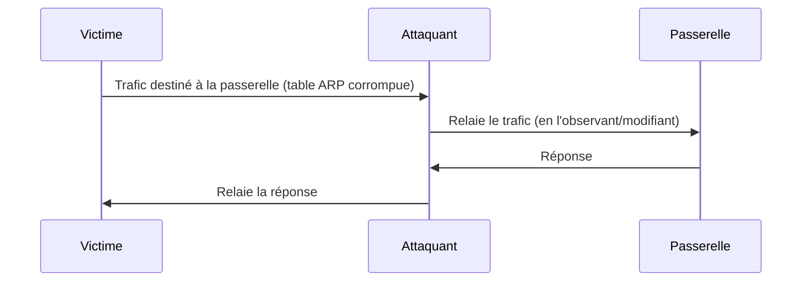
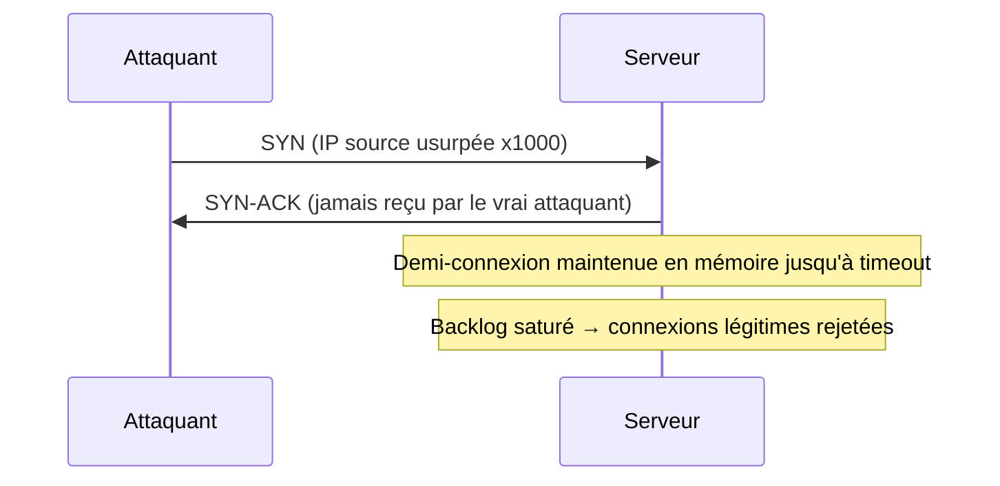

## Introduction

Ce dernier chapitre du cours Réseaux Informatiques referme la boucle en réunissant les attaques les plus emblématiques de la couche réseau — celles que tu manipuleras concrètement dans les labs Nyx Offensifs, et celles que tu devras détecter côté défense.

## ARP Spoofing et attaques Man-in-the-Middle

Le protocole ARP (Address Resolution Protocol) associe une adresse IP à une adresse MAC sur un réseau local — sans aucune authentification. Un attaquant peut donc répondre à une requête ARP à la place de la vraie machine et se positionner comme intermédiaire (Man-in-the-Middle).



<CehCallout>
L'ARP spoofing est l'une des attaques de couche 2 les plus testées au CEH et à l'eJPT — elle ne nécessite qu'un accès au même segment réseau que la victime, sans aucune vulnérabilité logicielle à exploiter.
</CehCallout>

<AttackDefenseTable rows={[
  { phase: "ARP Spoofing", attack: "Empoisonner le cache ARP de la victime pour intercepter son trafic", defense: "Dynamic ARP Inspection (DAI) sur les switches, entrées ARP statiques sur les postes critiques" },
  { phase: "MITM HTTPS", attack: "Intercepter du trafic chiffré via un certificat frauduleux", defense: "HSTS, certificate pinning, sensibilisation aux alertes de certificat invalide" },
  { phase: "DNS Spoofing", attack: "Répondre à une requête DNS avec une fausse adresse IP", defense: "DNSSEC, DNS over HTTPS (DoH)" },
]} />

## Déni de service (DoS) et déni de service distribué (DDoS)

Un déni de service vise à rendre un service indisponible, en épuisant ses ressources (bande passante, connexions, CPU) plutôt qu'en volant des données.

<CompareTable
  titleA="Type d'attaque"
  titleB="Principe"
  rows={[
    { a: "SYN Flood", b: "Envoi massif de paquets SYN sans compléter le handshake, épuisant la table de connexions" },
    { a: "UDP Flood", b: "Envoi massif de paquets UDP vers des ports aléatoires" },
    { a: "Amplification DNS/NTP", b: "Usurpation de l'IP victime pour rediriger de grandes réponses vers elle depuis des serveurs tiers" },
    { a: "DDoS applicatif (couche 7)", b: "Requêtes HTTP légitimes en très grand nombre, difficiles à distinguer du trafic normal" },
]}
/>

<WarningCallout>
Contrairement aux autres techniques de ce cours, les attaques par déni de service ne doivent **jamais** être testées, même dans un lab personnel non isolé — un DoS mal maîtrisé peut affecter des systèmes tiers ou une infrastructure partagée. Les labs Nyx n'incluent volontairement aucun exercice de ce type.
</WarningCallout>

### SYN Flood en détail : pourquoi la table de connexions s'épuise

Un serveur TCP alloue une structure mémoire (Transmission Control Block) dès réception d'un paquet SYN, en attente du dernier ACK du handshake à trois voies. Un attaquant qui envoie des SYN massifs avec une adresse source usurpée ne complète jamais ce handshake — chaque demi-connexion reste en mémoire jusqu'à expiration d'un délai, jusqu'à saturer la file d'attente (`backlog`) et empêcher toute nouvelle connexion légitime.



<TipCallout>
Les **SYN cookies** sont la contre-mesure historique la plus efficace : au lieu de stocker l'état de la demi-connexion en mémoire, le serveur encode les informations nécessaires directement dans le numéro de séquence du SYN-ACK, qu'il peut ensuite valider sans état lorsque l'ACK final arrive — plus aucune structure mémoire à épuiser.
</TipCallout>

### Attaques par amplification : un facteur de démultiplication critique

Une attaque par amplification usurpe l'adresse IP de la victime pour interroger des serveurs tiers légitimes (DNS, NTP, memcached) dont la réponse est bien plus volumineuse que la requête — démultipliant le trafic reçu par la victime sans que l'attaquant n'ait besoin d'une bande passante équivalente.

<CompareTable
  titleA="Protocole abusé"
  titleB="Facteur d'amplification approximatif"
  rows={[
    { a: "DNS (requête ANY)", b: "×28 à ×54" },
    { a: "NTP (commande monlist)", b: "×556 (historiquement, sur serveurs non patchés)" },
    { a: "Memcached", b: "×10 000 à ×50 000 — le facteur le plus élevé documenté à ce jour" },
  ]}
/>

<CehCallout>
Le facteur d'amplification explique pourquoi ces attaques restent redoutables malgré leur détection connue depuis des années : un attaquant disposant d'une bande passante modeste peut générer un trafic largement supérieur à celui d'une capacité réseau d'entreprise classique, simplement en usurpant l'IP de la victime dans ses requêtes vers des serveurs tiers mal configurés.
</CehCallout>

### DDoS applicatif (couche 7) : se fondre dans le trafic légitime

Contrairement aux floods volumétriques, un DDoS de couche 7 envoie des requêtes HTTP syntaxiquement valides — indiscernables du trafic normal par une simple inspection de paquets, ce qui le rend bien plus difficile à filtrer en amont.

<CompareTable
  titleA="Technique couche 7"
  titleB="Principe"
  rows={[
    { a: "Slowloris", b: "Ouvre de nombreuses connexions HTTP et les maintient artificiellement ouvertes en envoyant des en-têtes très lentement, épuisant le pool de connexions du serveur" },
    { a: "HTTP Flood", b: "Requêtes GET/POST légitimes en très grand volume, souvent vers des endpoints coûteux en calcul (recherche, génération de rapport)" },
    { a: "Attaque applicative ciblée", b: "Cible spécifiquement une fonctionnalité coûteuse (ex: recherche avec jointures complexes) plutôt que la page d'accueil statique" },
]}
/>

### Détecter un déni de service en amont

<Steps steps={[
  { title: "Analyse de flux réseau (NetFlow/sFlow)", description: "Un pic soudain du nombre de connexions ou de paquets par seconde depuis des sources dispersées est le premier signal, bien avant la saturation effective du service." },
  { title: "Seuils de débit et de connexions par IP", description: "Une IP ou un sous-réseau générant un volume de requêtes très supérieur à la normale (baseline) déclenche une alerte avant même que le service ne soit affecté." },
  { title: "Détection comportementale vs signature", description: "Un DDoS applicatif n'a pas de signature fixe (contrairement à un exploit connu) — la détection repose sur l'écart statistique par rapport à un comportement de référence, pas sur un motif reconnu." },
]} />

### Architectures de mitigation

<CompareTable
  titleA="Mécanisme"
  titleB="Principe"
  rows={[
    { a: "Scrubbing center", b: "Redirige tout le trafic vers un centre de nettoyage dédié qui filtre le trafic malveillant avant de relayer uniquement le trafic légitime vers l'infrastructure réelle" },
    { a: "Anycast", b: "Annonce la même adresse IP depuis plusieurs points de présence géographiques — le trafic d'attaque se répartit automatiquement entre plusieurs sites au lieu de saturer un point unique" },
    { a: "RTBH (Remotely Triggered Black Hole)", b: "Annonce BGP qui redirige délibérément tout le trafic vers une IP ciblée vers le néant — sacrifie la disponibilité de cette IP précise pour préserver le reste de l'infrastructure" },
    { a: "CDN en absorption de périphérie", b: "Absorbe et met en cache une grande partie du trafic HTTP au plus près de la source, avant qu'il n'atteigne l'infrastructure d'origine" },
]}
/>

<AuditCallout>
Un plan de réponse DDoS documenté (contacts opérateur/CDN, seuils d'alerte, procédure d'activation du scrubbing) a bien plus de valeur en situation réelle qu'une architecture de mitigation coûteuse jamais testée en amont — la fonction "Respond" du NIST Cybersecurity Framework s'applique directement ici.
</AuditCallout>

## Contre-mesures réseau générales

<Steps steps={[
  { title: "Segmentation stricte (VLANs, zones)", description: "Limite la portée d'une attaque de couche 2 comme l'ARP spoofing à un seul segment." },
  { title: "Chiffrement systématique", description: "TLS partout, y compris en interne, pour rendre une interception de trafic inexploitable." },
  { title: "Surveillance et détection (IDS/IPS, SIEM)", description: "Détecte les motifs anormaux (scan, exfiltration, C2) avant qu'ils n'aboutissent." },
  { title: "Anti-DDoS et limitation de débit (rate limiting)", description: "Filtre ou absorbe les pics de trafic anormaux avant qu'ils n'atteignent l'infrastructure critique." },
]} />

<AuditCallout>
La fonction "Detect" du NIST Cybersecurity Framework (vue au chapitre 4 du cours Introduction à la Cybersécurité) recouvre directement ces mécanismes de surveillance réseau — ce chapitre en est l'application technique concrète.
</AuditCallout>

## Lab — Mise en Pratique

**Environnement** : Kali Linux (terminal Nyx Shell)

<Steps steps={[
  { title: "Observer la table ARP locale", description: "Liste les associations IP/MAC connues sur ton segment réseau.", code: "ip neigh show" },
  { title: "Détecter une entrée ARP suspecte", description: "Recherche si plusieurs adresses IP répondent avec la même adresse MAC (signe d'usurpation).", code: "arp -a | awk '{print $4}' | sort | uniq -c | sort -rn" },
  { title: "Documenter une contre-mesure", description: "Pour chaque attaque de ce chapitre (ARP spoofing, MITM HTTPS, DNS spoofing), note la contre-mesure la plus efficace à mettre en place en priorité sur un réseau d'entreprise." },
]} />

## Pour aller plus loin

### DHCP starvation : épuiser le pool d'adresses

Une variante de l'attaque DHCP vue au chapitre 4 : plutôt que d'installer un serveur DHCP non autorisé, un attaquant peut épuiser le pool d'adresses du serveur légitime en multipliant les requêtes DHCP Discover avec des adresses MAC usurpées différentes à chaque fois. Une fois le pool épuisé, les nouvelles machines ne peuvent plus obtenir d'adresse — ouvrant la voie à l'installation d'un serveur DHCP malveillant, cette fois seul disponible.

<AttackDefenseTable rows={[
  { phase: "DHCP Starvation", attack: "Épuiser le pool DHCP avec des requêtes usurpées en masse", defense: "DHCP snooping + limitation du nombre de baux par port switch" },
]} />

### Le rôle clé du DAI (Dynamic ARP Inspection)

Le **DAI**, mentionné comme contre-mesure à l'ARP spoofing, fonctionne en croisant chaque réponse ARP avec une table de correspondance IP/MAC de confiance — généralement construite à partir des baux DHCP snoopés (`DHCP Snooping` doit être activé au préalable). Toute réponse ARP qui ne correspond pas à cette table est bloquée par le switch avant même d'atteindre la victime.

<TipCallout>
DHCP Snooping et Dynamic ARP Inspection fonctionnent en tandem : le premier construit la table de confiance, le second l'utilise pour filtrer — activer l'un sans l'autre laisse la protection incomplète.
</TipCallout>

### Recon-ng et Shodan : l'OSINT réseau à grande échelle

Au-delà des techniques actives vues dans ce cours, deux outils structurent la reconnaissance réseau à grande échelle sans jamais toucher directement la cible :

<CompareTable
  titleA="Outil"
  titleB="Usage"
  rows={[
    { a: "Shodan", b: "Moteur de recherche indexant les services exposés sur Internet (bannières, versions, ports) — permet de trouver des cibles vulnérables sans scanner soi-même" },
    { a: "Recon-ng", b: "Framework de reconnaissance modulaire automatisant la collecte OSINT (sous-domaines, emails, technologies utilisées)" },
]}
/>

```bash
# Rechercher les instances exposées d'un service précis via l'API Shodan (nécessite une clé API)
shodan search "apache" "country:FR"
```

<CehCallout>
Shodan illustre un principe clé de la reconnaissance passive : l'information est souvent déjà publique et indexée, il suffit de savoir où et comment la chercher, sans jamais interagir directement avec la cible ni risquer de la détection.
</CehCallout>

## Ce que tu as construit sur ces 8 chapitres

Ce cours t'a fait parcourir la pile réseau de bout en bout : des couches OSI/TCP-IP théoriques jusqu'aux attaques concrètes de couche 2, en passant par l'adressage, les protocoles applicatifs, la segmentation, le périmètre (pare-feu/NAT/VPN) et l'analyse de trafic. Ces fondations réseau, combinées à celles du cours Linux, forment le socle technique sur lequel repose absolument tout le reste de ton parcours offensif et défensif — c'est pour cette raison que ces deux cours arrivent en premier dans le programme Nyx.

## En résumé

- L'ARP spoofing exploite l'absence d'authentification du protocole ARP pour se positionner en Man-in-the-Middle.
- Le déni de service vise la disponibilité plutôt que la confidentialité ou l'intégrité — et ne doit jamais être testé hors cadre strictement autorisé.
- Un SYN flood épuise la table de connexions du serveur ; les SYN cookies éliminent ce risque en rendant le serveur "sans état" durant le handshake.
- Les attaques par amplification (DNS, NTP, memcached) démultiplient le trafic reçu par la victime bien au-delà de la bande passante réelle de l'attaquant ; un DDoS de couche 7 (Slowloris, HTTP Flood) se fond au contraire dans du trafic syntaxiquement légitime.
- La détection repose sur l'analyse de flux et les écarts comportementaux plutôt que sur des signatures fixes ; la mitigation combine scrubbing, Anycast, RTBH et CDN selon le type d'attaque.
- Segmentation, chiffrement, détection et anti-DDoS forment les quatre piliers de la défense réseau.
- Ces mécanismes recoupent directement la fonction "Detect" du NIST Cybersecurity Framework.

## Questions de Révision

1. Pourquoi l'ARP spoofing ne nécessite-t-il aucune vulnérabilité logicielle pour fonctionner ?
2. Quelle est la différence entre un DoS et un DDoS ?
3. Comment les SYN cookies neutralisent-ils un SYN flood sans épuiser la mémoire du serveur ?
4. Pourquoi une attaque par amplification memcached est-elle particulièrement redoutable comparée à une amplification DNS classique ?
5. Pourquoi un DDoS de couche 7 (Slowloris, HTTP Flood) est-il plus difficile à détecter qu'un flood volumétrique classique ?
6. Pourquoi les labs Nyx n'incluent-ils volontairement aucun exercice de déni de service ?

Félicitations, tu viens de terminer le cours **Réseaux Informatiques** ! Direction le cours **Sécurité Web (OWASP)** pour appliquer ces fondations à l'exploitation d'applications web.
