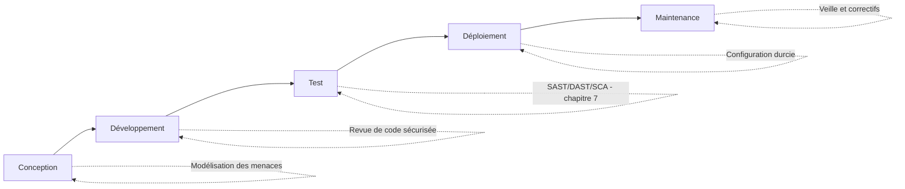

## Introduction

Ce cours va au-delà du cours Sécurité Web (OWASP), qui se concentre sur l'exploitation de vulnérabilités déjà présentes dans une application — ici, l'angle est différent : comment concevoir et développer une application, et en particulier ses API, pour qu'un maximum de ces vulnérabilités n'apparaissent jamais.

## Pourquoi la sécurité en fin de cycle coûte plus cher

<CehCallout>
Corriger une faille de sécurité découverte en production coûte généralement bien plus cher (temps, réputation, urgence) que la même faille détectée à la conception — un principe qui justifie le "Secure Software Development Life Cycle" (SSDLC), qui intègre la sécurité à chaque étape du développement plutôt qu'en test final.
</CehCallout>

<WarningCallout>
Rappel du cours Administration Systèmes et Réseaux : plus une faille est détectée tard dans le cycle de vie, plus son impact et son coût de correction sont importants — un principe identique à celui déjà rencontré pour la maintenance des systèmes en production.
</WarningCallout>

## La modélisation des menaces (threat modeling)

<CehCallout>
La modélisation des menaces est un exercice structuré, réalisé dès la conception, qui consiste à identifier systématiquement ce qui pourrait mal tourner dans une application avant même d'écrire la moindre ligne de code — un raisonnement proactif, à l'opposé de l'approche réactive du pentest qui teste une application déjà construite.
</CehCallout>

<Steps steps={[
  { title: "Modéliser l'architecture", description: "Représenter les composants de l'application et leurs flux de données (souvent via un diagramme de flux de données, DFD)." },
  { title: "Identifier les frontières de confiance", description: "Repérer les points où les données traversent une frontière de confiance (ex : d'Internet vers le serveur applicatif)." },
  { title: "Énumérer les menaces à chaque frontière", description: "Pour chaque frontière, se demander systématiquement ce qui pourrait être attaqué — c'est ici qu'intervient le modèle STRIDE." },
  { title: "Prioriser et traiter", description: "Classer les menaces identifiées par risque et définir une mesure d'atténuation pour chacune." },
]} />

## Le modèle STRIDE

<CompareTable
  titleA="Catégorie STRIDE"
  titleB="Menace"
  rows={[
    { a: "Spoofing (usurpation)", b: "Se faire passer pour un autre utilisateur ou système" },
    { a: "Tampering (altération)", b: "Modifier des données ou du code sans autorisation" },
    { a: "Repudiation (répudiation)", b: "Nier avoir réalisé une action, faute de journalisation suffisante" },
    { a: "Information disclosure (divulgation)", b: "Exposer des informations à des utilisateurs non autorisés" },
    { a: "Denial of Service (déni de service)", b: "Rendre un service indisponible" },
    { a: "Elevation of privilege (élévation de privilège)", b: "Obtenir des droits supérieurs à ceux accordés" },
]}
/>

<TipCallout>
STRIDE structure la réflexion pour ne rien oublier — pour chaque composant et chaque flux de données de l'architecture, on se demande méthodiquement s'il est vulnérable à chacune des six catégories, plutôt que de réfléchir aux menaces de façon improvisée.
</TipCallout>

## Threat modeling appliqué à une API

<CehCallout>
Une API expose généralement une frontière de confiance très nette entre un client (potentiellement non maîtrisé) et le système d'information — le threat modeling d'une API doit donc porter une attention particulière à l'authentification (spoofing), à la validation des entrées (tampering) et au contrôle d'accès sur chaque endpoint (élévation de privilège), des thèmes détaillés aux chapitres suivants.
</CehCallout>

## Lab — Mise en Pratique

**Environnement** : Réflexion guidée (sans terminal)

<Steps steps={[
  { title: "Identifier les frontières de confiance", description: "Pour une application web classique (client, serveur applicatif, base de données), identifie les frontières de confiance traversées par une requête utilisateur." },
  { title: "Appliquer STRIDE à un cas simple", description: "Pour un formulaire de connexion, identifie au moins une menace STRIDE plausible pour trois catégories différentes du modèle." },
]} />

## En résumé

- Le SSDLC intègre la sécurité à chaque étape du développement, plutôt qu'en test final, car une faille détectée tard coûte bien plus cher à corriger.
- Le threat modeling identifie proactivement les menaces dès la conception, en modélisant l'architecture et ses frontières de confiance.
- Le modèle STRIDE structure cette réflexion en six catégories de menaces (usurpation, altération, répudiation, divulgation, déni de service, élévation de privilège).

## Questions de Révision

1. Pourquoi une faille de sécurité détectée en production coûte-t-elle généralement plus cher qu'une faille détectée à la conception ?
2. Qu'est-ce qu'une frontière de confiance dans un diagramme de flux de données ?
3. Que signifient les six lettres de l'acronyme STRIDE ?
