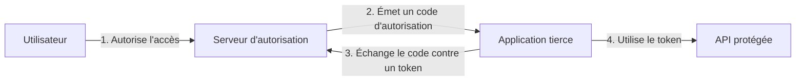

## Introduction

Ce chapitre détaille les mécanismes d'authentification et d'autorisation spécifiques aux API — un prolongement du chapitre "Authentification et gestion de sessions" du cours Sécurité Web, adapté au contexte où le client n'est pas un navigateur avec des cookies, mais souvent une autre application ou un service tiers.

## OAuth 2.0 — déléguer l'accès sans partager de mot de passe

<CehCallout>
OAuth 2.0 est un protocole qui permet à une application tierce d'accéder à des ressources pour le compte d'un utilisateur, sans que celui-ci ne partage jamais son mot de passe avec cette application tierce — au lieu de cela, l'utilisateur autorise explicitement l'accès, et l'application tierce reçoit un jeton d'accès (access token) limité en portée et en durée.
</CehCallout>



<TipCallout>
Le principe clé d'OAuth 2.0 est la portée (scope) : un token peut être limité à des permissions précises (par exemple "lecture seule du profil"), ce qui applique directement le principe de moindre privilège déjà rencontré à plusieurs reprises dans le parcours Nyx, y compris au niveau de l'autorisation déléguée entre applications.
</TipCallout>

## JWT — JSON Web Token

<CehCallout>
Un JWT est un format de jeton auto-porteur (self-contained) : il contient lui-même, encodé et signé, les informations nécessaires à son vérification (identité de l'utilisateur, permissions, date d'expiration), ce qui évite au serveur de devoir interroger une base de données à chaque requête pour vérifier la session — contrairement à un identifiant de session classique, purement opaque.
</CehCallout>

```text
Un JWT est composé de trois parties séparées par des points :
en-tête.charge_utile.signature

En-tête : algorithme de signature utilisé
Charge utile : les informations (claims) — identité, rôle, expiration
Signature : garantit que le jeton n'a pas été altéré depuis son émission
```

<WarningCallout>
Rappel du cours Cryptographie Avancée (chapitre 4, intégrité par hachage) : la signature d'un JWT garantit son intégrité, mais la charge utile elle-même n'est pas chiffrée par défaut — elle est seulement encodée en base64, lisible par quiconque intercepte le jeton. Ne jamais placer d'information sensible non chiffrée dans la charge utile d'un JWT.
</WarningCallout>

## Les vulnérabilités classiques des JWT

<CompareTable
  titleA="Vulnérabilité JWT"
  titleB="Principe"
  rows={[
    { a: "Algorithme 'none' accepté", b: "Certaines implémentations mal configurées acceptent un jeton sans aucune signature si l'en-tête l'indique" },
    { a: "Confusion d'algorithme (RS256 vers HS256)", b: "Un attaquant force le serveur à vérifier avec une clé symétrique qu'il connaît, au lieu de la clé publique asymétrique attendue" },
    { a: "Secret faible en HS256", b: "Un secret de signature trop court ou prévisible peut être retrouvé par bruteforce (rappel cours Cryptographie Avancée, chapitre 3)" },
    { a: "Absence de vérification d'expiration", b: "Un jeton expiré reste accepté si le serveur ne vérifie pas correctement le claim 'exp'" },
]}
/>

## Clés API — authentification simple entre systèmes

<CehCallout>
Une clé API est un identifiant secret unique, généralement statique, transmis à chaque requête pour authentifier une application ou un service (pas un utilisateur individuel) — plus simple qu'OAuth 2.0, mais offrant bien moins de granularité (pas de portée limitée, pas d'expiration automatique par défaut).
</CehCallout>

<CompareTable
  titleA="Clé API"
  titleB="OAuth 2.0 / JWT"
  rows={[
    { a: "Authentifie généralement une application ou un service", b: "Peut authentifier un utilisateur individuel avec des permissions précises" },
    { a: "Souvent statique, sans expiration automatique", b: "Généralement limité en durée (expiration) et en portée (scope)" },
    { a: "Simple à mettre en œuvre mais rotation manuelle", b: "Plus complexe mais bien plus granulaire et révocable" },
]}
/>

<WarningCallout>
Une clé API codée en dur dans le code source d'une application (notamment côté client, mobile ou frontend) est une erreur fréquente et critique — rappel du chapitre 6 sur la chaîne d'approvisionnement logicielle : toute clé API doit être stockée côté serveur ou dans un coffre-fort de secrets, jamais exposée dans du code distribué au client.
</WarningCallout>

## Lab — Mise en Pratique

**Environnement** : Kali Linux (terminal Nyx Shell)

<Steps steps={[
  { title: "Décoder un JWT", description: "Décode la charge utile d'un JWT intercepté sans connaître son secret de signature, et observe les informations lisibles en clair.", code: "echo '<partie_charge_utile_du_jwt>' | base64 -d" },
  { title: "Identifier une confusion d'algorithme", description: "Explique pourquoi un serveur JWT vérifiant un jeton RS256 avec la clé publique utilisée comme secret HS256 peut être trompé par un attaquant connaissant cette clé publique." },
]} />

## En résumé

- OAuth 2.0 permet une délégation d'accès sans partage de mot de passe, via des tokens limités en portée et en durée.
- Un JWT est auto-porteur et signé, mais sa charge utile n'est qu'encodée, jamais chiffrée par défaut — aucune donnée sensible ne doit y figurer en clair.
- Les clés API authentifient généralement des applications entières, avec moins de granularité que l'OAuth 2.0/JWT, et doivent toujours rester côté serveur.

## Questions de Révision

1. Quel est l'intérêt principal d'OAuth 2.0 par rapport au partage direct d'un mot de passe avec une application tierce ?
2. Pourquoi ne faut-il jamais placer d'information sensible non chiffrée dans la charge utile d'un JWT ?
3. Pourquoi une clé API codée en dur dans une application mobile ou frontend est-elle une pratique dangereuse ?
