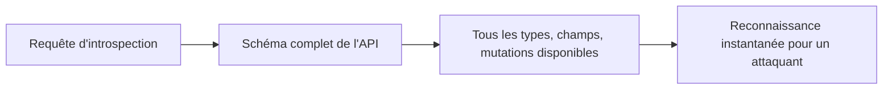

## Introduction

Ce chapitre aborde GraphQL, une alternative de plus en plus répandue aux API REST étudiées au chapitre 2 — sa flexibilité, qui fait sa force pour les développeurs, introduit aussi des risques de sécurité structurellement différents de ceux d'une API REST classique.

## GraphQL — une API, un seul point d'entrée

<CehCallout>
Contrairement à une API REST qui expose de nombreux endpoints (un par ressource et action), une API GraphQL expose généralement un unique point d'entrée où le client précise lui-même, dans sa requête, exactement quelles données il souhaite récupérer — une flexibilité qui déplace une partie du contrôle habituellement côté serveur vers le client.
</CehCallout>

```text
Requête GraphQL typique — le client choisit précisément les champs demandés :
query {
  utilisateur(id: "42") {
    nom
    email
    commandes {
      id
      montant
    }
  }
}
```

<WarningCallout>
Cette flexibilité signifie qu'une même vulnérabilité de contrôle d'accès (BOLA, chapitre 2) peut se manifester de façon bien plus subtile en GraphQL : un attaquant peut composer une requête qui traverse plusieurs relations imbriquées pour atteindre des données auxquelles il ne devrait pas avoir accès, sans jamais toucher un endpoint "sensible" isolé et facilement identifiable.
</WarningCallout>

## L'introspection — une fonctionnalité pratique, un risque en production

<CehCallout>
GraphQL propose nativement une fonctionnalité d'introspection : interroger l'API pour obtenir la description complète de son schéma (tous les types, champs et opérations disponibles) — extrêmement utile en développement, mais un cadeau pour un attaquant si elle reste activée en production, car elle révèle instantanément toute la surface d'attaque de l'API sans reconnaissance manuelle.
</CehCallout>



<TipCallout>
Rappel du cours Cybersécurité Offensive (chapitre 2, reconnaissance) : l'introspection GraphQL activée en production équivaut à fournir gratuitement à un attaquant le résultat de toute une phase de reconnaissance qu'il aurait normalement dû mener lui-même — la désactiver en production est une mesure de durcissement simple et à fort impact.
</TipCallout>

## Attaques par requêtes imbriquées et par batching

<WarningCallout>
La flexibilité de GraphQL permet à un client de construire des requêtes profondément imbriquées (une relation dans une relation dans une relation) ou de regrouper de nombreuses requêtes en une seule (batching) — sans limite de profondeur ou de complexité imposée côté serveur, une requête unique peut générer une charge de calcul disproportionnée, un vecteur de déni de service applicatif.
</WarningCallout>

<Steps steps={[
  { title: "Limiter la profondeur des requêtes", description: "Imposer un nombre maximal de niveaux d'imbrication autorisés dans une requête GraphQL." },
  { title: "Limiter la complexité calculée", description: "Attribuer un coût à chaque champ et refuser les requêtes dont le coût total dépasse un seuil défini." },
  { title: "Limiter le débit (rate limiting)", description: "Rappel du chapitre 2 (Unrestricted Resource Consumption) : appliquer une limitation de débit, y compris sur un unique point d'entrée GraphQL." },
]} />

## Lab — Mise en Pratique

**Environnement** : Réflexion guidée (sans terminal)

<Steps steps={[
  { title: "Expliquer le risque de l'introspection en production", description: "Pourquoi l'introspection GraphQL activée en production simplifie-t-elle considérablement le travail de reconnaissance d'un attaquant ?" },
  { title: "Concevoir une requête imbriquée abusive", description: "Pour l'exemple de requête GraphQL de ce chapitre, imagine comment un attaquant pourrait imbriquer la relation 'commandes' de façon récursive pour surcharger le serveur." },
]} />

## En résumé

- GraphQL expose généralement un unique point d'entrée où le client compose lui-même la structure de sa requête, déplaçant une partie du contrôle vers le client.
- L'introspection, utile en développement, doit être désactivée en production car elle révèle instantanément tout le schéma de l'API à un attaquant.
- Sans limite de profondeur ou de complexité, une requête GraphQL imbriquée ou groupée (batching) peut générer une charge disproportionnée côté serveur.

## Questions de Révision

1. En quoi la structure d'une API GraphQL diffère-t-elle fondamentalement de celle d'une API REST ?
2. Pourquoi l'introspection GraphQL est-elle un risque si elle reste activée en production ?
3. Quelles mesures permettent de limiter le risque de déni de service via des requêtes GraphQL imbriquées ?
