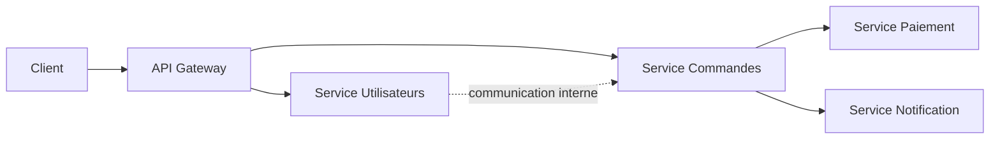

## Introduction

Ce chapitre aborde les enjeux de sécurité propres aux architectures en microservices — un ensemble de nombreux services indépendants communiquant entre eux via des API, plutôt qu'une seule application monolithique, un modèle de plus en plus répandu que ce cours doit couvrir spécifiquement.

## Pourquoi les microservices élargissent la surface d'attaque

<WarningCallout>
Une architecture monolithique expose généralement peu de points d'entrée réseau ; une architecture en microservices multiplie les API internes communiquant entre services — chacune de ces communications inter-services est une frontière de confiance potentielle (rappel du chapitre 1, threat modeling), qui doit être sécurisée exactement comme une API exposée publiquement.
</WarningCallout>

<CehCallout>
Rappel du cours Cybersécurité Défensive (chapitre 3, Zero Trust) : dans une architecture microservices, chaque flèche du diagramme ci-dessus est une communication qui devrait, en toute rigueur, être authentifiée et chiffrée — la supposer "sûre" simplement parce qu'elle reste interne au réseau de l'entreprise reproduit exactement l'erreur du modèle "château fort" déjà critiqué.
</CehCallout>

## mTLS — authentification mutuelle entre services

<CehCallout>
Le mTLS (mutual TLS) étend le principe du TLS classique (rappel cours Cryptographie Avancée, chapitre 7) : au lieu que seul le serveur prouve son identité au client via un certificat, les deux parties présentent chacune un certificat — chaque service prouve son identité à l'autre avant tout échange de données.
</CehCallout>

<CompareTable
  titleA="TLS classique (client-serveur web)"
  titleB="mTLS (inter-services)"
  rows={[
    { a: "Seul le serveur présente un certificat", b: "Client ET serveur (chaque service) présentent un certificat" },
    { a: "Le client fait confiance au serveur identifié", b: "Chaque service vérifie mutuellement l'identité de l'autre" },
    { a: "Empêche l'interception mais pas l'usurpation du client", b: "Empêche également qu'un service compromis ou non autorisé s'insère dans la communication" },
]}
/>

<TipCallout>
Dans une architecture microservices à grande échelle, le mTLS est souvent géré automatiquement par un "service mesh" (une couche d'infrastructure dédiée) plutôt que configuré manuellement dans chaque service — ce qui garantit une application cohérente du chiffrement mutuel sans dépendre de la rigueur de chaque équipe de développement.
</TipCallout>

## Le service compromis comme pivot

<WarningCallout>
Rappel du cours Cybersécurité Offensive (chapitre 7, mouvement latéral) : dans une architecture microservices sans authentification inter-services rigoureuse, un attaquant ayant compromis un seul service périphérique (par exemple un service de notification peu critique) peut ensuite l'utiliser comme pivot pour interroger librement des services bien plus sensibles (paiement, données personnelles), exactement comme un mouvement latéral dans un environnement Active Directory.
</WarningCallout>

<Steps steps={[
  { title: "Authentifier chaque appel inter-services", description: "Ne jamais faire confiance à une requête interne simplement parce qu'elle provient du réseau interne (rappel Zero Trust)." },
  { title: "Limiter les permissions de chaque service", description: "Rappel du principe de moindre privilège : un service de notification n'a besoin d'aucun accès aux données de paiement." },
  { title: "Segmenter le réseau interne", description: "Rappel du cours Cybersécurité Défensive (chapitre 3) : limiter les communications réseau possibles entre services à ce qui est strictement nécessaire." },
]} />

## Lab — Mise en Pratique

**Environnement** : Réflexion guidée (sans terminal)

<Steps steps={[
  { title: "Identifier un pivot possible", description: "Dans le schéma d'architecture de ce chapitre, si le Service Notification est compromis, quels autres services pourrait-il potentiellement atteindre sans authentification inter-services rigoureuse ?" },
  { title: "Expliquer l'intérêt du mTLS", description: "Pourquoi le mTLS protège-t-il mieux qu'un simple chiffrement TLS à sens unique dans une communication entre deux microservices ?" },
]} />

## En résumé

- Une architecture microservices multiplie les communications inter-services, chacune constituant une frontière de confiance à sécuriser.
- Le mTLS étend le TLS classique en exigeant une authentification mutuelle : chaque service prouve son identité à l'autre.
- Un service périphérique compromis peut servir de pivot vers des services plus sensibles si la confiance réseau interne est implicite plutôt que vérifiée à chaque appel.

## Questions de Révision

1. Pourquoi une architecture microservices élargit-elle la surface d'attaque par rapport à un monolithe ?
2. Quelle est la différence entre TLS classique et mTLS ?
3. Pourquoi un service périphérique peu critique peut-il tout de même représenter un risque majeur dans une architecture microservices ?
