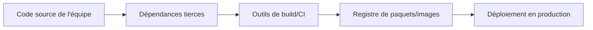

## Introduction

Ce chapitre aborde un angle souvent négligé de la sécurité applicative : le code qu'une équipe écrit elle-même ne représente généralement qu'une fraction du code réellement exécuté par une application moderne — l'essentiel provient de dépendances tierces (bibliothèques, frameworks), chacune une porte d'entrée potentielle.

## Qu'est-ce que la chaîne d'approvisionnement logicielle

<CehCallout>
La chaîne d'approvisionnement logicielle (software supply chain) désigne l'ensemble des composants, outils et dépendances qui interviennent entre l'écriture du code source et son exécution en production — bibliothèques open source, outils de build, images de conteneurs de base, registres de paquets.
</CehCallout>

<WarningCallout>
Chaque maillon de cette chaîne est une cible potentielle — une dépendance tierce compromise (malveillante dès sa publication, ou compromise après coup par un attaquant ayant pris le contrôle du compte d'un mainteneur) peut introduire du code malveillant directement dans des milliers d'applications qui l'utilisent, sans jamais toucher directement le code de ces applications.
</WarningCallout>

## Les risques classiques des dépendances tierces

<CompareTable
  titleA="Risque"
  titleB="Principe"
  rows={[
    { a: "Vulnérabilité connue non corrigée", b: "Une dépendance utilisée contient une CVE publiée, mais l'application ne l'a jamais mise à jour" },
    { a: "Dépendance abandonnée (non maintenue)", b: "Un composant critique n'est plus maintenu, aucune correction de sécurité future n'est à attendre" },
    { a: "Typosquatting de paquet", b: "Un attaquant publie un paquet malveillant au nom très proche d'un paquet légitime, espérant une faute de frappe à l'installation" },
    { a: "Compromission d'un mainteneur légitime", b: "Le compte d'un mainteneur d'un paquet légitime et populaire est compromis, permettant de publier une version malveillante" },
]}
/>

<CehCallout>
Rappel du cours Machine Learning (chapitre 3) : de la même façon qu'un audit de code cherche des vulnérabilités dans le code écrit par l'équipe, un audit de dépendances (chapitre 7, SCA) cherche systématiquement des vulnérabilités connues dans l'ensemble des bibliothèques tierces utilisées, souvent bien plus nombreuses que le code propre de l'application.
</CehCallout>

## Le SBOM — inventaire des composants logiciels

<CehCallout>
Un SBOM (Software Bill of Materials) est un inventaire structuré et exhaustif de tous les composants logiciels (avec leurs versions précises) qui composent une application — un peu comme la liste des ingrédients d'un produit alimentaire, il permet de savoir précisément quels composants sont utilisés, sans devoir les redécouvrir a posteriori lorsqu'une nouvelle CVE critique est publiée.
</CehCallout>

<Steps steps={[
  { title: "Générer le SBOM au moment du build", description: "Un SBOM est généré automatiquement à partir des dépendances réellement utilisées lors de la construction de l'application." },
  { title: "Conserver et versionner le SBOM", description: "Chaque version de l'application dispose de son propre SBOM, permettant de savoir exactement quels composants elle contenait à un instant donné." },
  { title: "Croiser le SBOM avec les nouvelles CVE", description: "Lorsqu'une CVE critique est publiée sur un composant courant, interroger directement les SBOM des applications en production pour identifier immédiatement celles qui sont concernées." },
]} />

<TipCallout>
Sans SBOM, répondre à la question "sommes-nous affectés par cette nouvelle CVE critique publiée ce matin ?" peut nécessiter des heures d'investigation manuelle sur chaque application — avec un SBOM à jour, cette réponse devient quasi immédiate, une capacité de plus en plus exigée réglementairement (rappel du cours Droit et Réglementation de la Cybersécurité, NIS2).
</TipCallout>

## Lab — Mise en Pratique

**Environnement** : Réflexion guidée (sans terminal)

<Steps steps={[
  { title: "Expliquer le risque du typosquatting", description: "Pourquoi un développeur pressé, tapant rapidement le nom d'une dépendance, peut-il installer par erreur un paquet malveillant au nom presque identique au paquet légitime ?" },
  { title: "Justifier l'intérêt d'un SBOM", description: "Une CVE critique est publiée ce matin sur une bibliothèque de traitement d'images très répandue. Sans SBOM, quelles étapes manuelles ton équipe devrait-elle suivre pour savoir si vos applications sont concernées ?" },
]} />

## En résumé

- La chaîne d'approvisionnement logicielle regroupe tous les composants tiers (dépendances, outils de build, images de base) qui interviennent avant la mise en production.
- Une dépendance compromise, abandonnée ou victime de typosquatting peut introduire du code malveillant sans jamais toucher directement le code de l'application.
- Le SBOM, inventaire exhaustif des composants d'une application, permet une réponse quasi immédiate face à une nouvelle CVE critique publiée sur un composant courant.

## Questions de Révision

1. Qu'est-ce que la chaîne d'approvisionnement logicielle, et pourquoi représente-t-elle un risque distinct du code propre d'une application ?
2. Donne deux exemples de risques classiques liés aux dépendances tierces.
3. Qu'est-ce qu'un SBOM, et en quoi accélère-t-il la réponse à une nouvelle CVE critique ?
