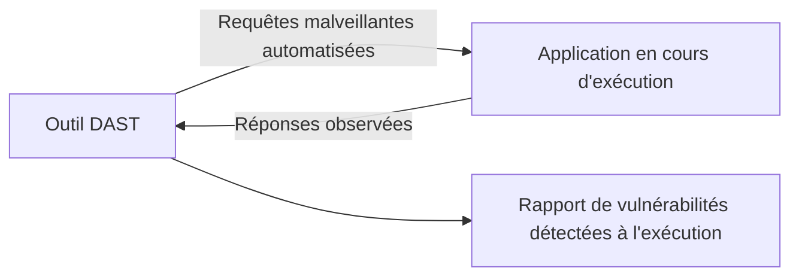

## Introduction

Ce chapitre détaille les trois grandes familles d'outils de test de sécurité automatisés, indispensables pour appliquer à grande échelle les principes du SSDLC (chapitre 1) sans dépendre uniquement d'audits manuels ponctuels — chacune de ces approches détecte une catégorie différente de problèmes, aucune n'étant suffisante isolément.

## SAST — Static Application Security Testing

<CehCallout>
Le SAST analyse le code source d'une application sans jamais l'exécuter — il recherche des motifs de code potentiellement vulnérables (une requête SQL construite par concaténation de chaînes, par exemple) directement dans les fichiers source, un peu comme une relecture de code automatisée et systématique.
</CehCallout>

<CompareTable
  titleA="Avantage du SAST"
  titleB="Limite du SAST"
  rows={[
    { a: "Détecte les vulnérabilités très tôt, dès l'écriture du code", b: "Génère souvent de nombreux faux positifs, nécessitant un tri manuel" },
    { a: "N'a besoin d'aucun environnement d'exécution", b: "Ne peut pas détecter les vulnérabilités qui n'apparaissent qu'à l'exécution (mauvaise configuration serveur, par exemple)" },
]}
/>

## DAST — Dynamic Application Security Testing

<CehCallout>
Le DAST teste une application en cours d'exécution, de l'extérieur, en lui envoyant des requêtes malveillantes et en observant ses réponses — une approche qui se rapproche directement d'un pentest automatisé (rappel du cours Cybersécurité Offensive), sans jamais avoir accès au code source.
</CehCallout>

<TipCallout>
Rappel du TP sqlmap (cours Sécurité Web) : un outil DAST automatise, à grande échelle et sur l'ensemble d'une application, exactement le type de tests qu'un pentesteur mènerait manuellement avec des outils comme sqlmap ou Burp Suite — l'avantage du DAST est sa capacité à tester en continu, à chaque déploiement, sans intervention humaine répétée.
</TipCallout>

<WarningCallout>
Le DAST, contrairement au SAST, ne peut détecter que ce qui est réellement accessible et exercé pendant le test — une fonctionnalité rarement utilisée ou mal couverte par les scénarios de test peut dissimuler une vulnérabilité que le DAST ne détectera jamais.
</WarningCallout>

## SCA — Software Composition Analysis

<CehCallout>
Rappel du chapitre 6 (chaîne d'approvisionnement logicielle) : le SCA analyse spécifiquement les dépendances tierces d'une application (pas le code propre de l'équipe) pour identifier celles qui contiennent des vulnérabilités connues (CVE) déjà publiées — un outil SCA compare la liste des dépendances utilisées, avec leurs versions précises, à des bases de données de vulnérabilités publiques.
</CehCallout>

<CompareTable
  titleA="Approche"
  titleB="Ce qu'elle analyse"
  rows={[
    { a: "SAST", b: "Le code source propre de l'application, sans exécution" },
    { a: "DAST", b: "L'application en cours d'exécution, testée de l'extérieur" },
    { a: "SCA", b: "Les dépendances tierces et leurs vulnérabilités connues (CVE)" },
]}
/>

## Pourquoi ces trois approches sont complémentaires

<WarningCallout>
Aucune de ces trois approches ne couvre à elle seule l'ensemble des risques d'une application — le SAST manque les failles de configuration à l'exécution, le DAST manque le code jamais exercé pendant le test, et le SCA ne dit rien du code propre de l'équipe ; une stratégie de test de sécurité robuste combine systématiquement les trois, intégrées au pipeline CI/CD (chapitre 8).
</WarningCallout>

## Lab — Mise en Pratique

**Environnement** : Réflexion guidée (sans terminal)

<Steps steps={[
  { title: "Choisir l'outil adapté à un scénario", description: "Pour détecter qu'une bibliothèque tierce utilisée par l'application contient une CVE critique publiée la semaine dernière, quel type d'outil (SAST, DAST ou SCA) est le plus adapté ?" },
  { title: "Expliquer une limite du DAST", description: "Pourquoi un outil DAST pourrait-il ne jamais détecter une vulnérabilité présente dans une fonctionnalité rarement testée de l'application ?" },
]} />

## En résumé

- Le SAST analyse le code source sans exécution, détectant tôt mais avec de nombreux faux positifs.
- Le DAST teste une application en cours d'exécution de l'extérieur, comme un pentest automatisé, mais ne détecte que ce qui est réellement exercé pendant le test.
- Le SCA analyse spécifiquement les dépendances tierces pour repérer des CVE connues, complétant les deux autres approches qui ne couvrent pas ce risque.

## Questions de Révision

1. Quelle est la différence fondamentale entre l'approche du SAST et celle du DAST ?
2. Que recherche spécifiquement un outil SCA, par opposition au SAST et au DAST ?
3. Pourquoi aucune de ces trois approches, isolément, ne suffit-elle à couvrir l'ensemble des risques d'une application ?
