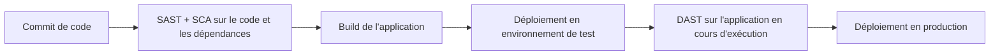

## Introduction

Ce dernier chapitre referme le cours en assemblant tous les concepts précédents (threat modeling, sécurité API, SAST/DAST/SCA) dans un cadre opérationnel concret : le pipeline d'intégration et de déploiement continu (CI/CD), où la sécurité doit s'intégrer sans ralentir excessivement la livraison logicielle.

## Le principe du DevSecOps

<CehCallout>
DevSecOps prolonge le mouvement DevOps (rapprochement entre développement et exploitation) en y intégrant la sécurité comme une responsabilité partagée par toute l'équipe, automatisée à chaque étape du pipeline, plutôt que confiée exclusivement à une équipe sécurité séparée intervenant tardivement — un prolongement direct du principe SSDLC du chapitre 1.
</CehCallout>

<WarningCallout>
Rappel du chapitre 1 : une sécurité ajoutée tardivement, en fin de pipeline, coûte plus cher et ralentit davantage la livraison qu'une sécurité intégrée dès le départ — le DevSecOps répond directement à cette réalité en automatisant les vérifications de sécurité à chaque étape plutôt qu'en un contrôle final unique et bloquant.
</WarningCallout>

## Où intégrer SAST, DAST et SCA dans le pipeline

<CehCallout>
Rappel du chapitre 7 : chaque type de test de sécurité automatisé a un moment naturel d'intégration dans le pipeline CI/CD, déterminé par ce dont il a besoin pour fonctionner (code source seul, ou application en cours d'exécution).
</CehCallout>

<Steps steps={[
  { title: "SAST au commit ou à la pull request", description: "Le code source est disponible dès cette étape, sans besoin d'exécuter l'application." },
  { title: "SCA dès la résolution des dépendances", description: "Dès que le fichier de dépendances est connu, le SCA peut vérifier chaque composant contre les bases de CVE." },
  { title: "DAST après déploiement en environnement de test", description: "Le DAST nécessite une application réellement en cours d'exécution pour l'attaquer de l'extérieur." },
  { title: "Bloquer ou alerter selon la criticité", description: "Une vulnérabilité critique bloque le déploiement automatiquement ; une vulnérabilité mineure peut simplement générer une alerte pour traitement ultérieur." },
]} />

<TipCallout>
Ce dernier point est essentiel : un pipeline qui bloque systématiquement au moindre avertissement mineur finit par être contourné par les équipes sous pression de livraison — une politique de criticité graduée, où seules les vulnérabilités réellement critiques bloquent le déploiement, est indispensable pour que la sécurité automatisée reste réellement respectée.
</TipCallout>

## Synthèse — panorama complet du cours

<CompareTable
  titleA="Chapitre"
  titleB="Contribution au panorama"
  rows={[
    { a: "1. SSDLC et threat modeling", b: "Intégrer la sécurité dès la conception, identifier les menaces avec STRIDE" },
    { a: "2. OWASP API Security Top 10", b: "Les vulnérabilités spécifiques aux API, en particulier BOLA" },
    { a: "3. OAuth 2.0, JWT et clés API", b: "Authentifier et autoriser correctement les échanges avec une API" },
    { a: "4. GraphQL", b: "Les risques spécifiques d'une API à point d'entrée unique et flexible" },
    { a: "5. Microservices", b: "Sécuriser la communication inter-services avec mTLS et Zero Trust" },
    { a: "6. Chaîne d'approvisionnement", b: "Maîtriser les risques des dépendances tierces avec un SBOM" },
    { a: "7. SAST, DAST, SCA", b: "Automatiser la détection de vulnérabilités à chaque niveau" },
    { a: "8. DevSecOps", b: "Intégrer l'ensemble dans un pipeline CI/CD opérationnel" },
]}
/>

## Lab — Mise en Pratique

**Environnement** : Réflexion guidée (sans terminal)

<Steps steps={[
  { title: "Positionner les outils dans un pipeline", description: "Pour un pipeline CI/CD simple (commit, build, test, déploiement), indique à quelle étape intégrer SAST, SCA et DAST respectivement, et justifie chaque choix." },
  { title: "Justifier une politique de criticité graduée", description: "Pourquoi un pipeline qui bloque systématiquement le déploiement au moindre avertissement de sécurité mineur risque-t-il d'être contourné par les équipes de développement ?" },
]} />

## En résumé

- Le DevSecOps automatise la sécurité à chaque étape du pipeline CI/CD, plutôt que de la confier à un contrôle final tardif et bloquant.
- SAST et SCA s'intègrent tôt (dès le code et les dépendances connues), tandis que le DAST nécessite une application déployée en environnement de test.
- Une politique de criticité graduée, qui ne bloque que les vulnérabilités réellement critiques, est indispensable pour que la sécurité automatisée soit durablement respectée par les équipes.

## Questions de Révision

1. En quoi le DevSecOps prolonge-t-il directement le principe du SSDLC vu au chapitre 1 ?
2. Pourquoi le SCA peut-il s'exécuter plus tôt dans le pipeline que le DAST ?
3. Pourquoi une politique de blocage systématique au moindre avertissement mineur est-elle contre-productive à long terme ?

Félicitations, tu viens de terminer le cours **Sécurité des Applications et des API** ! Tu maîtrises désormais la sécurité applicative au-delà de l'exploitation de vulnérabilités déjà présentes — de la conception (threat modeling) à la mise en production automatisée (DevSecOps), en passant par les risques spécifiques aux API modernes, aux microservices et à la chaîne d'approvisionnement logicielle. Ces compétences complètent directement le cours Sécurité Web (OWASP) et s'appliquent à l'ensemble des applications et API que tu rencontreras en pentest comme en développement sécurisé.
