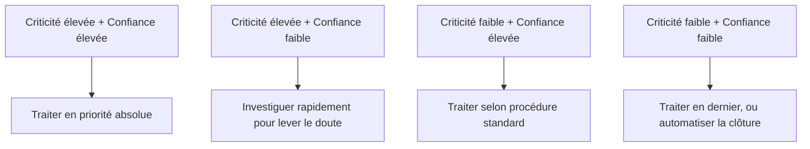

## Introduction

Ce chapitre détaille la compétence centrale d'un analyste N1 : transformer un flux continu d'alertes brutes en décisions rapides et justifiées — accepter, investiguer davantage, ou clôturer comme faux positif.

## Une méthodologie de triage structurée

<Steps steps={[
  { title: "Comprendre ce que signale l'alerte", description: "Quelle règle de détection s'est déclenchée, et sur quel comportement précis ?" },
  { title: "Rassembler le contexte immédiat", description: "Utilisateur ou machine concernés, historique récent, réputation de l'IP source (rappel du cours IA & Agents en Cybersécurité, chapitre 5, sur l'enrichissement automatique de contexte)." },
  { title: "Évaluer la plausibilité", description: "Ce comportement est-il cohérent avec une activité légitime connue (voyage professionnel, changement d'horaire), ou clairement anormal ?" },
  { title: "Décider et documenter", description: "Clôturer avec justification, escalader avec le contexte rassemblé, ou déclencher une action de confinement immédiate si la criticité l'exige." },
]} />

## Prioriser selon criticité et confiance

<CompareTable
  titleA="Axe"
  titleB="Question posée"
  rows={[
    { a: "Criticité", b: "Si cette alerte s'avère être une vraie attaque, quel serait l'impact (systèmes concernés, données en jeu) ?" },
    { a: "Confiance", b: "Quelle est la fiabilité de la règle de détection à l'origine de l'alerte — génère-t-elle souvent des faux positifs ?" },
]}
/>

<CehCallout>
Une alerte à criticité élevée mais confiance faible (par exemple, un comportement rare mais pas nécessairement malveillant sur un serveur critique) mérite souvent d'être investiguée AVANT une alerte à confiance élevée mais criticité faible — le risque potentiel, pas seulement la certitude, doit orienter la priorisation.
</CehCallout>

## La fatigue d'alerte — un risque à gérer activement

<WarningCallout>
Rappel du cours Administration Systèmes et Réseaux (chapitre 6) : un volume excessif d'alertes à faible valeur conduit inévitablement à la fatigue d'alerte, où même des analystes expérimentés commencent à clôturer machinalement sans examen suffisant — c'est un facteur documenté derrière plusieurs incidents majeurs où une alerte légitime avait pourtant été générée mais ignorée.
</WarningCallout>

<Steps steps={[
  { title: "Ajuster régulièrement les règles de détection", description: "Une règle qui génère un volume disproportionné de faux positifs doit être révisée, pas simplement supportée indéfiniment." },
  { title: "Automatiser le tri des cas les plus évidents", description: "Rappel du cours IA & Agents en Cybersécurité (chapitre 5) : un agent IA peut pré-trier les cas clairement bénins, sous garde-fous appropriés." },
  { title: "Faire des pauses et alterner les tâches", description: "Un triage continu sans interruption sur de longues périodes dégrade mécaniquement la vigilance et la qualité des décisions." },
]} />

## Lab — Mise en Pratique

**Environnement** : Réflexion guidée (sans terminal)

<Steps steps={[
  { title: "Prioriser quatre alertes", description: "Classe ces quatre alertes par ordre de traitement : (a) criticité élevée/confiance élevée sur un serveur de test, (b) criticité élevée/confiance faible sur un serveur de production critique, (c) criticité faible/confiance élevée récurrente, (d) criticité faible/confiance faible isolée." },
  { title: "Proposer une mesure contre la fatigue d'alerte", description: "Une règle de détection génère 200 alertes par jour, dont 195 sont systématiquement des faux positifs. Que proposerais-tu ?" },
]} />

## En résumé

- Un triage structuré suit une séquence reproductible : comprendre l'alerte, rassembler le contexte, évaluer la plausibilité, décider et documenter.
- La priorisation combine criticité (impact potentiel) et confiance (fiabilité de la détection), pas la seule confiance.
- La fatigue d'alerte est un risque professionnel réel à gérer activement, par l'ajustement des règles, l'automatisation du tri évident et l'alternance des tâches.

## Questions de Révision

1. Quelles sont les quatre étapes d'une méthodologie de triage structurée ?
2. Pourquoi une alerte à criticité élevée mais confiance faible peut-elle mériter une priorité supérieure à une alerte à confiance élevée mais criticité faible ?
3. Cite deux mesures concrètes pour limiter la fatigue d'alerte dans une équipe SOC.
