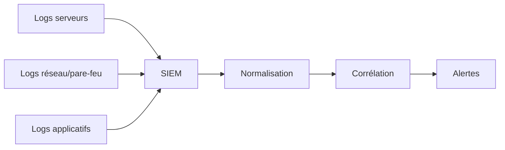

## Introduction

Le SIEM (Security Information and Event Management) est l'outil central du quotidien d'un analyste SOC — il collecte, normalise et corrèle les logs de l'ensemble du système d'information pour générer les alertes triées au chapitre précédent.

## Le rôle d'un SIEM



<CehCallout>
Un SIEM ne se contente pas de stocker des logs — sa valeur principale vient de la corrélation : relier des événements provenant de sources différentes (un pare-feu, un serveur, un contrôleur de domaine) qui, pris isolément, sembleraient anodins, mais qui ensemble révèlent une attaque en cours.
</CehCallout>

## Le principe de la corrélation

<Steps steps={[
  { title: "Normaliser les formats de logs", description: "Des logs provenant de sources différentes (formats variés) sont convertis vers un schéma commun exploitable uniformément." },
  { title: "Définir une fenêtre temporelle", description: "La corrélation cherche des relations entre événements survenus dans un intervalle de temps limité, pas sur l'ensemble de l'historique." },
  { title: "Appliquer une règle de corrélation", description: "Ex : 'une connexion échouée suivie de 4 autres échecs puis d'un succès, sur le même compte, en moins de 5 minutes' — signature typique d'une attaque par force brute réussie." },
]} />

<TipCallout>
Rappel du cours Active Directory & Windows (chapitre 3, sur les Event ID 4624/4625) : la corrélation d'un Event ID 4625 (échec de connexion) répété puis suivi d'un 4624 (succès), sur le même compte, en peu de temps, est une des règles de détection les plus classiques et les plus utiles d'un SIEM.
</TipCallout>

## Écrire une règle de détection simple

```text
Exemple de règle de détection (pseudo-code SIEM) :

RÈGLE : Bruteforce réussi
CONDITION :
  Event ID = 4625 (échec de connexion)
  COMPTE identique
  RÉPÉTÉ >= 5 fois
  DANS une fenêtre de 5 minutes
  SUIVI DE Event ID = 4624 (succès) sur le même compte
ACTION : Générer une alerte de criticité ÉLEVÉE
```

<WarningCallout>
Une règle de détection trop rigide (seuil exact, fenêtre temporelle fixe) peut être facilement contournée par un attaquant qui espace légèrement ses tentatives — un principe similaire au scan discret vu au TP Nmap (cours Réseaux) — d'où l'intérêt de règles combinant plusieurs signaux plutôt qu'un seuil unique isolé.
</WarningCallout>

## Corrélation et machine learning — un complément, pas un remplacement

<CehCallout>
Rappel du cours Data Science Complète (chapitre 6) : les règles de corrélation classiques détectent efficacement des motifs déjà connus et bien définis (comme le bruteforce ci-dessus), tandis que la détection d'anomalies par machine learning (ou par autoencodeur, cours IA & Agents en Cybersécurité, chapitre 2) complète ce dispositif en repérant des écarts inédits que aucune règle explicite n'a anticipés.
</CehCallout>

## Lab — Mise en Pratique

**Environnement** : Réflexion guidée (sans terminal)

<Steps steps={[
  { title: "Écrire une règle de corrélation", description: "Rédige une règle de détection (à la manière de l'exemple ci-dessus) pour repérer un compte de service qui se connecte soudainement depuis une machine inhabituelle, suivi d'une création de tâche planifiée." },
  { title: "Identifier une limite d'une règle rigide", description: "Pourquoi une règle de détection basée sur un seuil exact et une fenêtre temporelle fixe peut-elle être contournée par un attaquant patient ?" },
]} />

## En résumé

- Un SIEM collecte, normalise et corrèle des logs de sources multiples pour générer des alertes, sa valeur principale résidant dans la corrélation.
- Une règle de détection combine généralement plusieurs conditions (type d'événement, compte, fenêtre temporelle, séquence) pour capturer un motif d'attaque connu.
- Les règles de corrélation classiques et la détection d'anomalies par machine learning se complètent, l'une couvrant les motifs connus, l'autre les écarts inédits.

## Questions de Révision

1. Quelle est la valeur principale d'un SIEM, au-delà du simple stockage de logs ?
2. Donne un exemple de règle de corrélation détectant un bruteforce réussi.
3. Pourquoi les règles de corrélation classiques et la détection par machine learning sont-elles complémentaires plutôt que substituables ?
