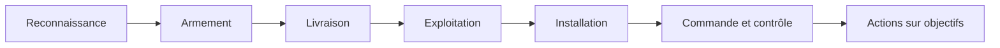

## Introduction

Une alerte isolée ne raconte souvent qu'une petite partie d'une histoire plus large. Ce chapitre présente deux cadres de référence qui aident un analyste SOC à situer une alerte dans le déroulement complet d'une attaque : la Cyber Kill Chain et MITRE ATT&CK.

## La Cyber Kill Chain

<CehCallout>
La Cyber Kill Chain, développée par Lockheed Martin, modélise une attaque comme une séquence de sept phases — son intérêt principal pour un analyste SOC est de situer une alerte donnée dans cette chronologie : une alerte de "commande et contrôle" (phase 6) est généralement bien plus critique qu'une alerte de "reconnaissance" (phase 1), même si les deux méritent attention.
</CehCallout>

<TipCallout>
Le principe défensif clé de la Kill Chain : plus une attaque est stoppée tôt dans la chaîne (idéalement dès la reconnaissance ou la livraison), moins l'impact final est important — un analyste qui repère et bloque une tentative de livraison de malware évite d'avoir à gérer les phases bien plus coûteuses d'installation et d'exfiltration.
</TipCallout>

## MITRE ATT&CK — un niveau de détail supérieur

<CompareTable
  titleA="Cyber Kill Chain"
  titleB="MITRE ATT&CK"
  rows={[
    { a: "7 phases générales et linéaires", b: "14 tactiques, chacune avec de nombreuses techniques précises documentées" },
    { a: "Vue d'ensemble simple, facile à communiquer", b: "Niveau de détail opérationnel exploitable pour la détection concrète" },
    { a: "Modèle plutôt séquentiel", b: "Les tactiques peuvent se combiner et se répéter dans un ordre variable" },
]}
/>

<CehCallout>
Rappel du cours Active Directory & Windows (chapitre 3, Kerberoasting) : cette technique précise est documentée dans MITRE ATT&CK sous la tactique "Credential Access" — chaque technique offensive étudiée dans les cours plus opérationnels (Active Directory, Cyber Offensive) trouve sa correspondance exacte dans ce référentiel, un langage commun entre attaquants, défenseurs et chercheurs.
</CehCallout>

## Utiliser ATT&CK pour prioriser la détection

<Steps steps={[
  { title: "Identifier les techniques les plus probables pour son secteur", description: "Toutes les organisations ne font pas face aux mêmes groupes de menace ni aux mêmes techniques privilégiées." },
  { title: "Cartographier ses règles de détection existantes sur ATT&CK", description: "Identifier quelles tactiques/techniques sont déjà couvertes, et lesquelles présentent un angle mort." },
  { title: "Prioriser le développement de nouvelles règles", description: "Combler en priorité les angles morts sur les techniques les plus probables et les plus critiques pour l'organisation." },
]} />

<WarningCallout>
Une erreur fréquente consiste à ne cartographier qu'après un incident, pour comprendre ce qui n'a pas été détecté — une cartographie proactive AVANT l'incident, révisée régulièrement, permet d'identifier les angles morts avant qu'ils ne soient exploités.
</WarningCallout>

## Lab — Mise en Pratique

**Environnement** : Réflexion guidée (sans terminal)

<Steps steps={[
  { title: "Situer une alerte dans la Kill Chain", description: "Une alerte signale une connexion sortante régulière et suspecte vers une IP externe inconnue (rappel du cours DFIR, chapitre 6, sur le beaconing). À quelle phase de la Cyber Kill Chain cela correspond-il le plus probablement ?" },
  { title: "Rechercher une technique ATT&CK", description: "À quelle tactique MITRE ATT&CK rattacherais-tu le Kerberoasting étudié au cours Active Directory & Windows ?" },
]} />

## En résumé

- La Cyber Kill Chain modélise une attaque en sept phases séquentielles, aidant à évaluer la criticité relative d'une alerte selon sa position dans la chaîne.
- MITRE ATT&CK offre un niveau de détail opérationnel supérieur, avec des tactiques et techniques précisément documentées.
- Cartographier ses règles de détection existantes sur ATT&CK permet d'identifier proactivement des angles morts avant qu'ils ne soient exploités.

## Questions de Révision

1. Pourquoi une alerte de "commande et contrôle" est-elle généralement plus critique qu'une alerte de "reconnaissance" dans la Kill Chain ?
2. Quelle est la principale différence de niveau de détail entre la Cyber Kill Chain et MITRE ATT&CK ?
3. Pourquoi vaut-il mieux cartographier ses règles de détection sur ATT&CK avant un incident plutôt qu'après ?
