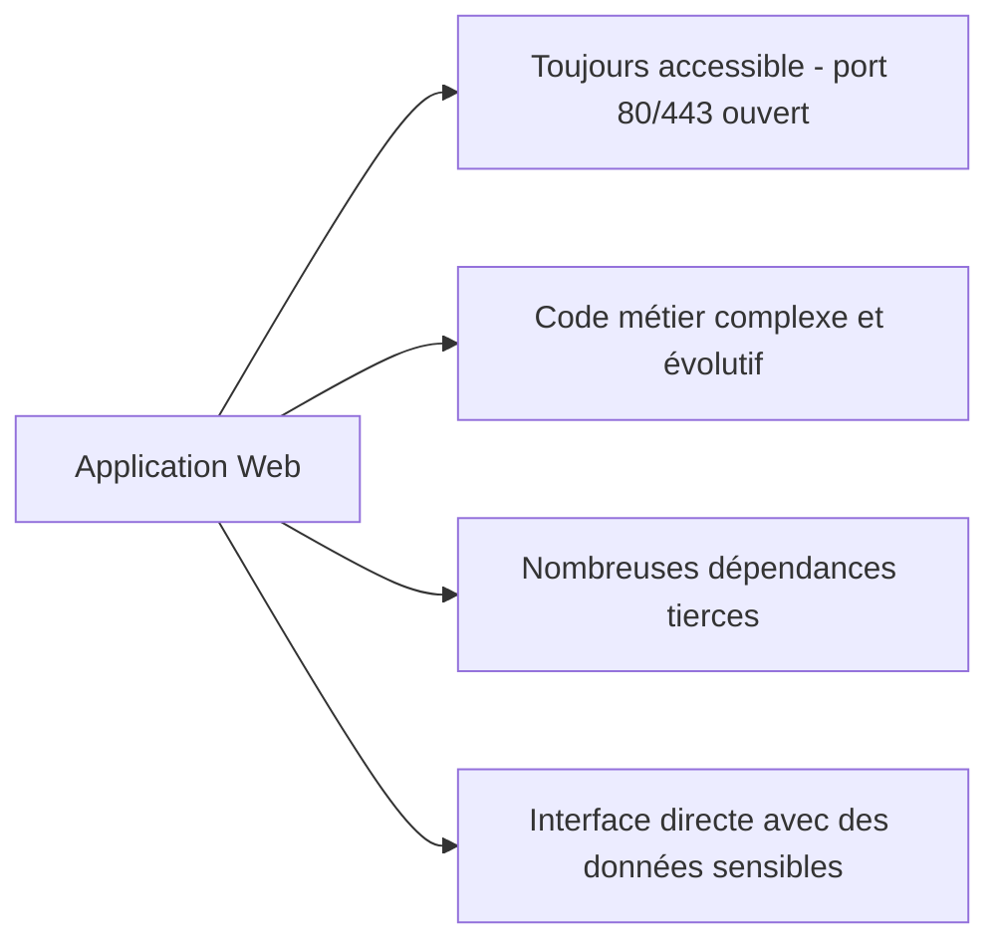

## Introduction

Les applications web sont, de loin, la surface d'attaque la plus exposée d'une organisation : accessibles depuis Internet 24h/24, développées par des équipes aux niveaux de maturité sécurité très variables, et souvent construites sur des piles technologiques complexes (framework, base de données, API tierces). Ce cours applique directement les fondations réseau et Linux déjà acquises à l'exploitation méthodique d'applications web vulnérables.

## Pourquoi le web concentre l'essentiel du risque

Contrairement à un service réseau interne, une application web publique est **par construction** exposée à quiconque sur Internet — un pare-feu ne peut pas filtrer le port 443 sans casser le service lui-même. La sécurité doit donc se jouer dans le code et la configuration de l'application, pas seulement au périmètre réseau.

## L'OWASP Top 10 : le référentiel de référence

L'OWASP (Open Web Application Security Project) publie régulièrement un classement des 10 catégories de risques les plus critiques pour les applications web, basé sur des données réelles d'incidents.

<CompareTable
  titleA="Catégorie (édition 2021)"
  titleB="Ce qu'elle couvre"
  rows={[
    { a: "A01 - Broken Access Control", b: "Contournement des restrictions d'accès (IDOR, élévation de privilèges)" },
    { a: "A02 - Cryptographic Failures", b: "Chiffrement absent, faible ou mal implémenté" },
    { a: "A03 - Injection", b: "SQL, commande, template — injecter du code interprété côté serveur" },
    { a: "A05 - Security Misconfiguration", b: "Configuration par défaut, services exposés inutilement" },
    { a: "A07 - Identification and Authentication Failures", b: "Authentification faible, gestion de session défaillante" },
  ]}
/>

<CehCallout>
Ce cours consacre un chapitre entier aux catégories les plus fréquemment exploitées en pratique (A01, A03, A07) et regroupe les autres dans un chapitre de synthèse — c'est la répartition suivie par la majorité des certifications pratiques (eJPT, OSCP, PNPT).
</CehCallout>

## Construire son environnement de test web

Un environnement de test web efficace repose sur trois éléments :

<Steps steps={[
  { title: "Un proxy d'interception", description: "Burp Suite (édition Community, gratuite) ou OWASP ZAP s'interposent entre le navigateur et l'application pour observer et modifier chaque requête." },
  { title: "Un navigateur configuré", description: "Le navigateur doit pointer son proxy HTTP/HTTPS vers l'outil d'interception (généralement 127.0.0.1:8080)." },
  { title: "Une cible délibérément vulnérable", description: "DVWA (Damn Vulnerable Web Application), utilisée dans les labs Nyx, est conçue spécifiquement pour l'apprentissage — jamais de test sur une cible réelle sans autorisation." },
]} />

<WarningCallout>
Toutes les techniques de ce cours doivent être pratiquées exclusivement sur les labs Nyx ou sur des applications que tu es explicitement autorisé à tester. Le rappel du chapitre légal du cours Introduction à la Cybersécurité s'applique intégralement ici.
</WarningCallout>

## Lab — Mise en Pratique

**Environnement** : Kali Linux (terminal Nyx Shell)

<Steps steps={[
  { title: "Identifier la stack technique d'une cible", description: "Récupère les en-têtes HTTP révélant serveur et framework utilisés.", code: "curl -I http://10.10.0.10" },
  { title: "Lister les pages et répertoires accessibles", description: "Lance une découverte de contenu basique avec gobuster.", code: "gobuster dir -u http://10.10.0.10 -w /usr/share/wordlists/dirb/common.txt" },
  { title: "Explorer la page d'accueil manuellement", description: "Récupère le code source HTML brut pour repérer commentaires et indices.", code: "curl -s http://10.10.0.10 | grep -i 'comment\\|todo\\|debug'" },
]} />

## En résumé

- Une application web est exposée en continu — la sécurité doit se jouer dans le code et la configuration, pas seulement au pare-feu.
- L'OWASP Top 10 catégorise les risques web les plus critiques, basé sur des données réelles d'incidents.
- Un proxy d'interception (Burp Suite, ZAP) est l'outil central de tout test d'intrusion web.
- DVWA et les labs Nyx fournissent un terrain d'entraînement légal et sûr.

## Questions de Révision

1. Pourquoi une application web publique ne peut-elle pas être protégée uniquement par un pare-feu réseau ?
2. Cite trois catégories de l'OWASP Top 10 2021.
3. Quel est le rôle d'un proxy d'interception comme Burp Suite ?
