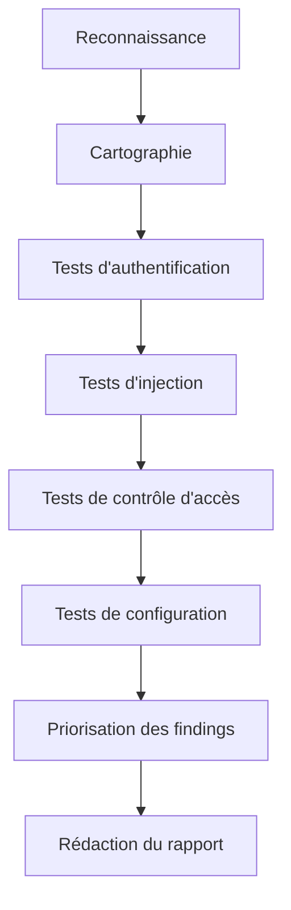

## Introduction

Ce dernier chapitre referme le cours en réunissant tout ce qui précède dans une méthodologie structurée, puis en abordant l'étape trop souvent négligée par les débutants : la rédaction du rapport, qui est en réalité le livrable qui donne toute sa valeur au test d'intrusion.

## Une méthodologie de test web complète



<CompareTable
  titleA="Phase"
  titleB="Chapitres de ce cours associés"
  rows={[
    { a: "Reconnaissance / Cartographie", b: "Chapitres 1 et 2" },
    { a: "Injection (SQL, XSS)", b: "Chapitres 3 et 4" },
    { a: "Authentification et contrôle d'accès", b: "Chapitres 5 et 6" },
    { a: "Configuration et composants", b: "Chapitre 7" },
  ]}
/>

<TipCallout>
Suivre cette séquence dans l'ordre n'est pas obligatoire en test réel — certaines vulnérabilités se révèlent en cascade (une IDOR peut révéler un endpoint permettant ensuite une injection). Garde cette structure comme checklist de couverture, pas comme un ordre rigide à respecter.
</TipCallout>

## Prioriser avec le CVSS

Le **CVSS (Common Vulnerability Scoring System)** attribue un score de 0 à 10 à chaque vulnérabilité selon des critères objectifs (vecteur d'attaque, complexité, privilèges requis, impact).

<CompareTable
  titleA="Score CVSS"
  titleB="Sévérité"
  rows={[
    { a: "9.0 - 10.0", b: "Critique" },
    { a: "7.0 - 8.9", b: "Élevée" },
    { a: "4.0 - 6.9", b: "Moyenne" },
    { a: "0.1 - 3.9", b: "Faible" },
  ]}
/>

<CehCallout>
Une injection SQL permettant un accès administrateur complet à la base de données obtient généralement un score CVSS critique (9+), tandis qu'une fuite d'information mineure (ex: version de serveur dans un en-tête) reste faible (2-3) — le score guide directement la priorité de correction côté client.
</CehCallout>

## Structure d'un rapport de pentest professionnel

<Steps steps={[
  { title: "Synthèse exécutive (1-2 pages)", description: "Destinée à la direction : contexte, nombre de vulnérabilités par sévérité, recommandation générale — sans jargon technique." },
  { title: "Méthodologie", description: "Périmètre testé, dates, techniques utilisées, limites du test (ce qui n'a PAS été testé)." },
  { title: "Détail de chaque vulnérabilité", description: "Description, preuve de concept (capture d'écran, requête/réponse), score CVSS, recommandation de correction précise." },
  { title: "Annexes techniques", description: "Sorties d'outils complètes, logs, captures détaillées — pour l'équipe technique qui devra corriger." },
]} />

```text
Exemple de structure pour UNE vulnérabilité dans le rapport :

Titre : Injection SQL sur le paramètre 'id' de /produit.php
Sévérité : Critique (CVSS 9.8)
Description : Le paramètre 'id' n'est pas validé et est concaténé directement...
Preuve de concept : [capture d'écran de sqlmap --dump]
Impact : Accès complet en lecture à la base de données clients, incluant les mots de passe hashés.
Recommandation : Remplacer la requête par une requête préparée (prepared statement) paramétrée.
```

<AuditCallout>
Une recommandation de correction vague ("sécuriser l'application") n'a aucune valeur actionnable — une bonne recommandation est spécifique, technique, et directement exploitable par l'équipe de développement (ex: "utiliser PDO::prepare() avec des paramètres liés").
</AuditCallout>

## Erreurs de rapport fréquentes chez les débutants

<WarningCallout>
Un rapport sans preuve de concept reproductible ("j'ai trouvé une injection SQL" sans la requête exacte utilisée) n'est pas crédible et ralentit considérablement la correction — le client doit pouvoir reproduire le problème pour valider le correctif appliqué.
</WarningCallout>

- Confondre sévérité technique et impact métier réel (une faille "critique" sur un serveur de test isolé n'a pas le même impact qu'en production)
- Copier-coller la sortie brute d'un outil sans l'expliquer en langage clair
- Oublier de documenter ce qui a été testé SANS trouver de vulnérabilité (utile pour prouver la couverture du test)

## Lab — Mise en Pratique

**Environnement** : Réflexion guidée + Kali Linux (terminal Nyx Shell)

<Steps steps={[
  { title: "Rédiger une synthèse exécutive fictive", description: "En 5 lignes maximum, résume pour une direction non technique les résultats d'un test ayant trouvé 1 faille critique et 3 moyennes." },
  { title: "Prioriser des vulnérabilités", description: "Attribue une sévérité (critique/élevée/moyenne/faible) à ces trois cas : (a) injection SQL avec accès admin BDD, (b) en-tête Server révélant la version Apache, (c) IDOR permettant de lire les commandes d'autres clients." },
  { title: "Documenter une vulnérabilité complète", description: "Reprends une vulnérabilité trouvée dans un lab Nyx précédent et rédige sa fiche complète selon la structure vue dans ce chapitre." },
]} />

## En résumé

- Une méthodologie de test web structurée couvre reconnaissance, injection, authentification, contrôle d'accès et configuration.
- Le CVSS objective la priorisation des vulnérabilités selon leur sévérité réelle.
- Un rapport professionnel comprend synthèse exécutive, méthodologie, détail de chaque vulnérabilité et annexes techniques.
- Une recommandation de correction doit toujours être spécifique et actionnable, jamais vague.

## Questions de Révision

1. Que signifie l'acronyme CVSS et à quoi sert-il ?
2. Cite les quatre sections principales d'un rapport de pentest professionnel.
3. Pourquoi une recommandation de correction vague ("sécuriser l'application") n'a-t-elle aucune valeur actionnable ?

Félicitations, tu viens de terminer le cours **Sécurité Web (OWASP)** ! Direction le cours **Active Directory & Windows** pour appliquer une méthodologie similaire à un environnement d'entreprise.
